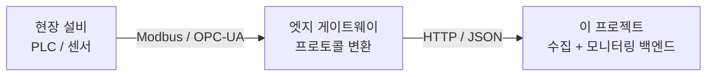
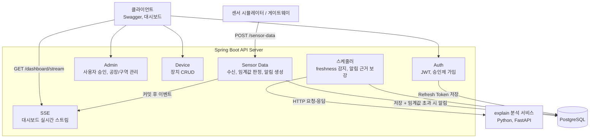
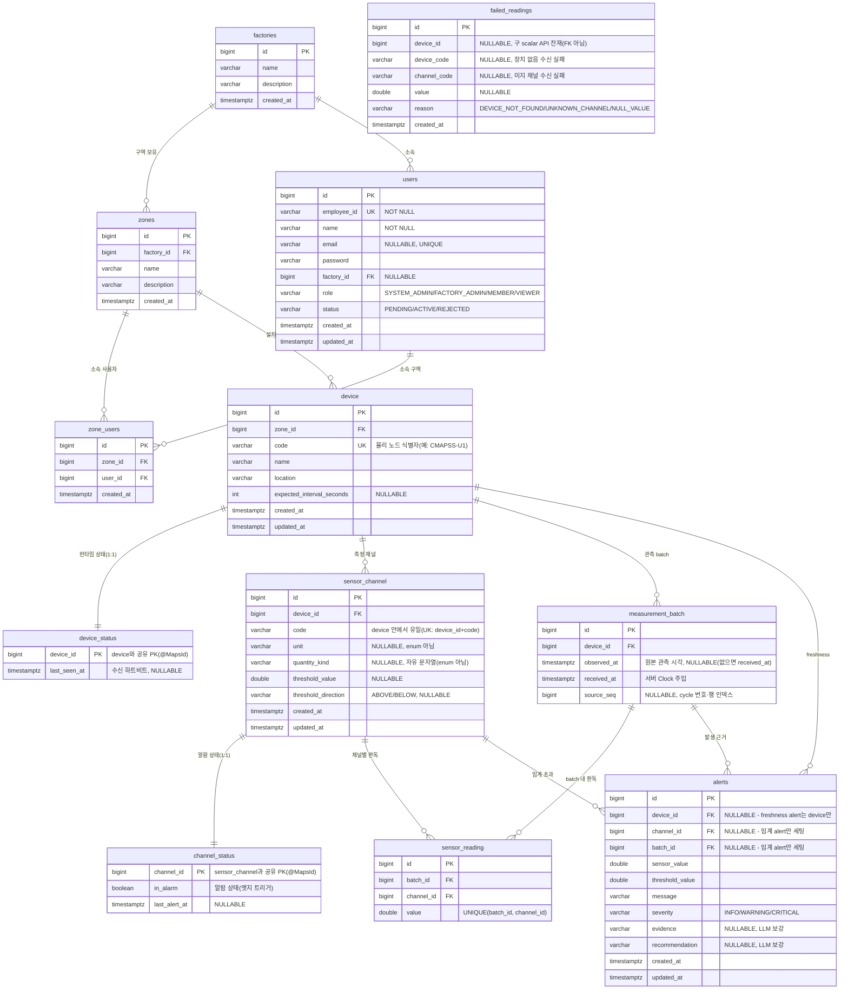

# Sensor Monitor

> 제조 설비 센서 데이터를 수집하고 이상 발생 시 근거와 함께 알림을 생성하는 센서 시계열 수집, 모니터링 백엔드

<br>


<br>

GitHub: https://github.com/YEONJI-P/sensor-monitor

<br>

---

## 목차

1. [프로젝트 소개](#1-프로젝트-소개)
2. [범위와 경계](#2-범위와-경계)
3. [기술 스택](#3-기술-스택)
4. [시스템 아키텍처](#4-시스템-아키텍처)
5. [ERD](#5-erd)
6. [API 명세](#6-api-명세)
7. [주요 기능](#7-주요-기능)
8. [확장 로드맵](#8-확장-로드맵)
9. [실행 방법](#9-실행-방법)
10. [설계 메모](#10-설계-메모)

---

## 1. 프로젝트 소개

제조 설비, 공장 환경에서 발생하는 센서 데이터를 수집하고, 임계값을 벗어난 이상 징후가 보이면 근거와 함께 알림을 생성하는 모니터링 백엔드입니다. 수집한 센서 시계열과 알림 이력은 영속 저장되어 사후 조회할 수 있습니다.

사번(employeeId) 기반의 승인제 회원 관리와 4단계 역할 기반 접근 제어(RBAC)를 통해, 공장, 구역 단위로 접근 범위를 제한합니다.

---

## 2. 범위와 경계

이 프로젝트는 게이트웨이가 HTTP/JSON으로 전달한 센서 데이터를 받아 저장하고 감시하는 백엔드입니다. 현장 프로토콜(Modbus, OPC-UA)의 수집과 변환은 범위 밖입니다.



실제 실시간 센서 대신, 저장된 센서 시계열을 시간 순으로 흘려보내 수신을 재현합니다.

---

## 3. 기술 스택

| 영역 | 기술 |
|---|---|
| Language | Java 17 |
| Framework | Spring Boot 3.x, Spring Security |
| Auth | JWT (JSON Web Token), Refresh Token 회전 |
| ORM | Spring Data JPA (Hibernate) |
| Database | PostgreSQL, Flyway |
| Realtime | Server-Sent Events (SSE) |
| AI Service | Python 3.11, FastAPI, uv |
| API Docs | Swagger (springdoc-openapi) |
| Test | JUnit5, Mockito, H2(부팅 스모크), Testcontainers(DB 계층), pytest |
| Container | Docker, Docker Compose |
| CI | GitHub Actions |

---

## 4. 시스템 아키텍처

센서 데이터 수신은 별도 메시지 버스 없이 동기 처리합니다. 수신 요청이 들어오면 한 트랜잭션 안에서 센서 데이터를 저장하고, 장치의 마지막 수신 시각을 갱신하고, 임계값 초과를 판정해 알림을 생성합니다. 저장과 알림 이벤트는 트랜잭션 커밋 후 SSE로 대시보드에 실시간 전달됩니다.

주기 스케줄러 두 개가 수신 경로 밖에서 동작합니다. 하나는 기대 수신 주기를 넘긴 침묵 장치를 감지하고, 다른 하나는 생성된 알림의 근거와 권고를 채우기 위해 별도 Python 분석 서비스(explain)를 HTTP로 호출합니다. 이상 탐지는 규칙 기반이고, 설명과 진단만 LLM이 담당합니다.



---

## 5. ERD



---

## 6. API 명세

Swagger UI: `http://localhost:23100/swagger-ui/index.html` (컨테이너 데모는 `8080`)


### Auth

| Method | Endpoint | 설명 | 인증 |
|---|---|---|---|
| POST | `/auth/register` | 가입 신청 (status=PENDING) | 불필요 |
| POST | `/auth/login` | 로그인, ACTIVE 상태만 허용 | 불필요 |
| POST | `/auth/refresh` | Access Token 재발급 | 불필요 |

### Admin (FACTORY_ADMIN 이상)

| Method | Endpoint | 설명 | 인증 |
|---|---|---|---|
| GET | `/admin/users` | 사용자 목록 (FACTORY_ADMIN은 소속 공장만) | JWT |
| GET | `/admin/users/pending` | 승인 대기 목록 (FACTORY_ADMIN은 소속 공장만) | JWT |
| PATCH | `/admin/users/{id}/approve` | 가입 승인 — ACTIVE 전환 + 역할 부여 + 구역 배정 (body: `role`, `zoneIds`) | JWT |
| PATCH | `/admin/users/{id}/reject` | 가입 반려, REJECTED 전환 | JWT |
| GET, POST | `/admin/factories` | 공장 조회, 등록 (SYSTEM_ADMIN) | JWT |
| PUT, DELETE | `/admin/factories/{id}` | 공장 수정, 삭제 (SYSTEM_ADMIN) | JWT |
| GET, POST | `/admin/zones` | 구역 조회, 등록 | JWT |
| PUT, DELETE | `/admin/zones/{id}` | 구역 수정, 삭제 | JWT |
| POST | `/admin/zones/{id}/users` | 구역에 사용자 추가 | JWT |
| DELETE | `/admin/zones/{id}/users/{userId}` | 구역에서 사용자 제거 | JWT |

### Device (조회는 인증, 쓰기는 SYSTEM_ADMIN, FACTORY_ADMIN, MEMBER)

| Method | Endpoint | 설명 | 인증 |
|---|---|---|---|
| GET | `/devices` | 내 장치 목록 | JWT |
| POST | `/devices` | 장치 등록 | JWT |
| PUT | `/devices/{id}` | 장치 수정 | JWT |
| DELETE | `/devices/{id}` | 장치 삭제 | JWT |

### Sensor Data

| Method | Endpoint | 설명 | 인증 |
|---|---|---|---|
| POST | `/sensor-data` | 배치 수신 (게이트웨이·시뮬레이터 → 서버). body: `deviceCode`, `observedAt?`, `sourceSeq?`, `measurements`(채널 code→value map) | 불필요 |

> 한 물리 노드(`deviceCode`)의 한 관측 시점(batch) 값 묶음을 한 요청으로 받습니다. 미지 채널·null 값은 예외 없이 부분 실패로 처리해 응답 `rejected`에 채널 코드와 사유(`UNKNOWN_CHANNEL`/`NULL_VALUE`)를 담고, 나머지 채널은 정상 저장합니다. 응답은 `batchId`·`deviceId`·`deviceCode`·`observedAt`·`receivedAt`·`savedCount`·`rejected`를 반환하며, 장치 없음은 404(batch 미생성), 요청 채널 전부가 미지·무효면 422(batch 미생성)입니다. 이전의 scalar 조회 API(`GET /sensor-data`, `GET /sensor-data/{deviceId}`)는 이 모델 전환과 함께 제거됐고, 조회는 아래 Channel API로 옮겼습니다.

### Channel

| Method | Endpoint | 설명 | 인증 |
|---|---|---|---|
| GET | `/channels` | 내 접근 범위의 채널 목록 (대시보드 드롭다운 소스) | JWT |
| GET | `/channels/{id}/readings?limit=` | 채널별 최근 판독 (`observed_at desc`, 기본·상한 500건) | JWT |
| POST | `/devices/{deviceId}/channels` | 채널 등록 | JWT |
| PUT | `/channels/{id}` | 채널 수정 (임계값·임계 방향 등) | JWT |

### Alert

| Method | Endpoint | 설명 | 인증 |
|---|---|---|---|
| GET | `/alerts` | 전체 알림 조회 (페이지네이션, `?page=&size=&sort=`) | JWT |
| GET | `/alerts/channel/{channelId}` | 채널별 알림 조회 | JWT |
| GET | `/alerts/recent?channelId=&limit=` | 채널별 최근 알림 (대시보드) | JWT |
| GET | `/alerts/daily-count?channelId=&days=` | 채널별 일자별 알림 수 (대시보드) | JWT |

> 임계 alert는 `deviceId`·`channelId` 둘 다 채워지고, freshness(수신 끊김) alert는 채널이 없어 `deviceId`만 채워집니다(`channelId=null`).

### 실시간 스트림 (SSE)

| Method | Endpoint | 설명 | 인증 |
|---|---|---|---|
| GET | `/dashboard/stream?token=` | 접근 범위 내 센서, 알림 이벤트 실시간 스트림 | 쿼리 토큰 |

> EventSource가 헤더를 못 실어 Access Token을 쿼리로 받습니다. 구독자는 자신의 접근 가능 장치로 이벤트가 필터링됩니다. `sensor-data` 이벤트는 batch 단위로 채널 판독 배열(`readings`)을 한 번에 담아 보냅니다.

### explain 분석 서비스 (Python, 로컬 `http://localhost:23200` · 컨테이너 데모 `8000`)

Spring이 스케줄러에서 HTTP로 호출하는 별도 서비스입니다. 탐지는 Spring의 규칙이 담당하고, 이 서비스는 설명과 진단만 생성합니다.

| Method | Endpoint | 설명 |
|---|---|---|
| POST | `/explain/anomaly` | 알림 근거(evidence)와 권고(recommendation) 생성 |
| POST | `/explain/freshness` | 장치 침묵 원인 진단 |

> LLM provider는 인터페이스로 분리돼 있습니다. 기본값은 키가 필요 없는 `echo`이고, 환경변수로 `gemini`로 교체할 수 있습니다.

---

## 7. 주요 기능

실시간 대시보드 — SSE로 센서값이 실시간 갱신되고, 임계값 초과 알림에는 LLM(explain 서비스)이 생성한 근거·권고가 붙습니다.


### 승인제 사용자 관리와 접근 제어

- 사번(employeeId) 기반 가입 신청, 가입 즉시 `PENDING` 상태로 저장
- `FACTORY_ADMIN` 이상의 관리자가 승인 또는 반려(`REJECTED`) 처리. 승인 시 `ACTIVE` 전환과 함께 역할 부여, 소속 구역 배정을 한 트랜잭션에서 수행
- `FACTORY_ADMIN`은 자신의 소속 공장 사용자만 조회, 승인할 수 있고 (`SYSTEM_ADMIN`은 전체), 부여 가능한 역할도 자기 역할 이하로 제한
- `PENDING`, `REJECTED` 상태에서 로그인 시 `DisabledException`으로 차단
- 4단계 역할 기반 접근 제어

  | 역할 | 범위 |
  |---|---|
  | `SYSTEM_ADMIN` | 전체 공장, 장치 |
  | `FACTORY_ADMIN` | 소속 공장의 구역, 장치, 사용자 관리 |
  | `MEMBER` | 소속 구역 읽기, 쓰기 (장치 관리) |
  | `VIEWER` | 소속 구역 읽기 전용 (장치 변경 불가) |

- 공장(Factory), 구역(Zone) 계층과 구역 소속 관계로 접근 범위를 계산하는 `AccessControlService`
- prod의 공개 데모 토폴로지는 Flyway V2가 자동 투입하고, local의 계정 포함 데모 데이터는 `services/simulator/seed.sql`로 별도 투입

### 센서 데이터 수신과 알림

- `POST /sensor-data` 수신 시 한 트랜잭션에서 센서 데이터 저장, 장치 수신 시각 갱신, 임계값 초과 판정, 알림 생성
- 알림은 **엣지 트리거**로 생성 — 정상에서 임계값 초과로 넘어가는 순간 한 건만 만들고, 초과가 지속되는 동안은 억제합니다. 값이 임계값 아래(히스테리시스 밴드)로 복귀하면 알람을 해제해 다음 초과를 다시 감지합니다. 초과가 지속되는 구간에서 같은 사건이 수십 건으로 도배되는 것을 막습니다
- severity는 초과 폭으로 판정(임계값 대비 여유가 크면 `CRITICAL`). 장치 런타임 상태(알람 여부·마지막 수신 시각)는 설정과 분리해 `device_status` 테이블에서 관리
- 별도 메시지 버스 없이 동기 처리 (설계 근거는 아래 설계 메모 참고)
- 이상 판정은 `AnomalyDetector` 전략 인터페이스로 분리(현재 `ThresholdDetector`), 판정 로직 교체 가능
- 검증 실패, 미등록 장치 요청은 조용히 버리지 않고 `failed_readings`에 사유와 함께 적재
- 알림은 severity(INFO/WARNING/CRITICAL)와 근거(evidence), 권고(recommendation) 필드를 가지며, 근거와 권고는 explain 서비스가 사후 보강

### 장치 freshness 감지

- 장치 설정에 기대 수신 주기(`expectedIntervalSeconds`)를 두고, 마지막 수신 시각(`lastSeenAt`)은 런타임 상태라 `device_status`에 두어 수신마다 갱신
- 주기 스케줄러가 기대 주기를 넘겨 침묵한 장치를 감지 (데이터가 안 오는 상황을 신호로 포착)
- 같은 구역 장치가 동시에 침묵하면 사이트 사건(계획 정지, 게이트웨이 장애)으로 보고 구역 한 건으로 집계(`WARNING`), 이웃이 정상 수신 중인데 단독 침묵하면 개별 고장으로 `CRITICAL` + explain 원인진단

### LLM 기반 이상 설명 (explain 서비스)

- 별도 Python/FastAPI 서비스가 알림 근거, 권고와 침묵 원인 진단을 생성
- 탐지는 규칙, 설명과 진단만 LLM이 담당
- provider를 인터페이스로 분리해 LLM 교체 가능(기본 `echo`, `gemini` 선택)

### 인증

- JWT 기반 stateless 인증, Refresh Token 은 PostgreSQL 에 저장
- Refresh Token 회전, 불일치 시 저장 토큰을 삭제해 강제 로그아웃 처리
- Access, Refresh 토큰에 `type` 클레임을 두어 Refresh 토큰으로는 API에 접근 불가

### 센서 시뮬레이터 (`services/simulator/simulator.py`)

- 실제 센서처럼 서버 외부에서 `POST /sensor-data`를 직접 호출
- 공개 실측 시계열(C-MAPSS 엔진, CNC 밀링)을 시간 순으로 리플레이 — 원본 한 행이 물리 device 하나의 관측 batch 하나(`measurements` 채널 code→value map)로 요청 1건이 됩니다
- 대상 device(`deviceCode`), 전송 간격(초), 행 수를 CLI 인자로 지정

### 실시간 대시보드

- 장치별 센서값 라인 차트, 알림 현황 시각화
- SSE(`/dashboard/stream`) 구독으로 수신, 알림 이벤트를 실시간 반영

---

## 8. 확장 로드맵

### 완료

- JWT 인증, 인가, 사번 기반 로그인, 승인제 가입
- 4단계 역할 기반 접근 제어, 공장, 구역 계층 접근 제어
- 가입 승인 워크플로 (역할 부여 + 구역 배정, FACTORY_ADMIN 소속 공장 스코핑)
- 동기 센서 수신 파이프라인 (수신, 저장, 임계값 판정, 알림)
- 이상 판정 로직 전략화 (`AnomalyDetector` 인터페이스로 분리)
- 알림 스키마 확장 (severity, 근거, 권고 필드)와 실패 수신 적재
- 장치 freshness 감지 (구역 코호트 판정으로 오탐 억제, 침묵 원인 explain 진단)
- SSE 기반 실시간 대시보드 (접근 범위 스코핑)
- LLM 기반 이상 근거, 원인 진단 (Python 분석 서비스 HTTP 연동)
- 실측 공개 센서 시계열(C-MAPSS 엔진, CNC 밀링) 리플레이로 시뮬레이터 데이터 교체
- Refresh Token 저장·회전 (PostgreSQL)

### 향후

- explain provider Gemini 실호출 (현재 기본 `echo`, 키 주입 시 전환)
- MQTT 수신 경로 도입 (엣지 게이트웨이와의 표준 연동)
- 대용량 시계열 저장소(TimescaleDB) 검토

---

## 9. 실행 방법

### 사전 요구사항

- Java 17
- 아래 두 모드 중 하나
  - **로컬 실행**: 공용 PostgreSQL 인스턴스(이 저장소 밖에서 실행, DB·계정 `sensor_monitor`)
  - **컨테이너 데모**: Docker, Docker Compose (자체 Postgres 포함, compose 하나로 전체 기동)

### 로컬 실행 (공용 Postgres + bootRun)

일상 개발용. 공용 Postgres 를 쓰고 backend 만 로컬에서 띄운다.

```bash
git clone https://github.com/YEONJI-P/sensor-monitor.git
cd sensor-monitor

# 공용 PostgreSQL 준비 — DB·사용자 sensor_monitor 가 실행 중이어야 함
# (앱 기본값이 jdbc:postgresql://localhost:5432/sensor_monitor 를 가리킴)

# JWT 서명 키 설정, 기본값이 없어 미설정 시 부팅 실패 (셸 export 또는 IDE 실행 구성)
export JWT_SECRET=$(head -c 48 /dev/urandom | base64)

# 애플리케이션 실행 (Spring은 services/backend/)
cd services/backend
./gradlew bootRun

# (선택) explain 분석 서비스만 컨테이너로: 루트에서 docker compose up -d explain
```

> 공용 Postgres 가 기본 접속정보와 다르면 `DB_URL`·`DB_USERNAME`·`DB_PASSWORD` 를 셸 env 로 재정의합니다. Spring 은 `.env` 를 자동 로드하지 않으므로 위 값은 셸/IDE 에 직접 주입합니다.

### 컨테이너 데모 (`docker compose up`)

평가자·데모용. postgres + backend + explain 을 한 번에 기동한다. 공용 DB 불필요.

```bash
cp .env.example .env          # JWT_SECRET 등 채우기 (compose 가 자동 로드)
docker compose up --build     # postgres + backend + explain

# 초기 데이터(계정/장치/임계값) 적재
docker compose exec -T postgres psql -U sensor_monitor -d sensor_monitor < services/simulator/seed.sql

# (선택) 실측 CSV 리플레이 배치 — seed 프로파일
docker compose --profile seed run --rm simulator --all
```

> 컨테이너 postgres 는 호스트 `5433` 에 노출됩니다(공용 `5432` 와 충돌 방지). backend 는 내부 네트워크(`postgres:5432`)로 접속하므로 `DB_*` 재정의는 필요 없습니다. 리플레이 데이터(`services/simulator/data/`)는 저장소에 포함되지 않으니 먼저 내려받아야 합니다.

### 테스트 실행

```bash
cd services/backend
./gradlew test
```

> 테스트는 세 갈래입니다.
> - **컨텍스트 부팅 스모크**(`contextLoads`)는 인메모리 H2 로 동작해 별도 인프라 없이 실행됩니다(엔티티 매핑·설정 오류를 싸게 잡는 용도이며, DB 계층은 검증하지 않습니다). 설정은 `services/backend/src/test/resources/application.yml`.
> - **DB 계층 검증**(리포지토리·네이티브 쿼리·제약·컬럼 타입)은 Testcontainers 로 프로덕션과 동일한 `postgres:15` 를 띄워 검증하므로 **로컬에 도커가 실행 중이어야 합니다**. 컨테이너는 한 번만 떠서 모든 리포지토리 테스트가 재사용합니다.
> - **운영 스키마 검증**(`FlywayMigrationTest`)은 빈 `postgres:15`에 prod 프로파일을 적용해 Flyway V1/V2/V3 실행, 공개 데모 토폴로지와 Hibernate `ddl-auto=validate` 부팅을 함께 확인합니다.

### Swagger UI

```
http://localhost:23100/swagger-ui/index.html
```

> bootRun 기본 포트는 `23100`. 컨테이너 데모(`docker compose up`)는 호스트 `8080`을 유지합니다.

### 로컬 데모 초기 데이터 투입 (`services/simulator/seed.sql`)

이 절은 Flyway를 끄고 Hibernate `ddl-auto=update`를 사용하는 local 실행 전용입니다. Spring Boot 기동 후 스키마가 준비된 상태에서 실행합니다. prod는 이 파일을 실행하지 않고 Flyway V3의 공장·구역·device·채널 토폴로지를 사용합니다.

> 기존 local DB가 이전 모델(방식 A, 채널=Device)로 이미 떠 있었다면 Hibernate `ddl-auto=update`는 컬럼·테이블을 삭제하지 않습니다. `device.type`·`device.threshold_value`·`sensor_data`·`device_status.in_alarm`/`last_alert_at`처럼 이번 전환에서 제거된 구 컬럼·테이블이 그대로 남아 새 엔티티·제약과 어긋날 수 있습니다. 이 모델 전환 이후의 로컬 개발은 기존 DB를 이어 쓰지 말고 빈 DB(스키마 재생성)에서 새로 시작하는 것을 권장합니다.

```bash
psql -U sensor_monitor -d sensor_monitor -f services/simulator/seed.sql
```

> 재실행이 필요한 경우 `seed.sql` 하단의 `TRUNCATE` 주석을 해제 후 먼저 실행하세요.
> 이 파일의 알려진 관리자·구성원 비밀번호는 로컬 시연용입니다. 공개 홈서버나 운영 DB에 투입하지 않습니다.

투입되는 샘플 계정

| employeeId | 이름 | Role | password |
|---|---|---|---|
| `SYSTEM` | 시스템 관리자 | SYSTEM_ADMIN | `admin1234!` |
| `ENG-ADMIN` | 엔진동 관리자 | FACTORY_ADMIN | `admin1234!` |
| `CNC-ADMIN` | 가공동 관리자 | FACTORY_ADMIN | `admin1234!` |
| `ENG-OP` | 엔진동 설비담당 | MEMBER | `op1234!` |
| `CNC-OP` | 가공동 설비담당 | MEMBER | `op1234!` |
| `ENG-VIEW` | 엔진동 열람 | VIEWER | `view1234!` |
| `CNC-VIEW` | 가공동 열람 | VIEWER | `view1234!` |

### 센서 시뮬레이터 실행 (`services/simulator/simulator.py`)

실측 공개 데이터(C-MAPSS, CNC)를 시간 순으로 리플레이해 `POST /sensor-data`로 전송합니다. 원본 한 행 = 물리 device 하나의 관측 batch 하나입니다.

```bash
# 1. 데이터 내려받기 (최초 1회)
bash services/simulator/data/download.sh

# 2. 의존성 설치
pip install requests

# 3. 전체 물리 device 3개 리플레이 (1초 간격)
python services/simulator/simulator.py --all

# 특정 device만 / 간격, 행수 조절
python services/simulator/simulator.py --devices CMAPSS-U1 CNC-EXP01 --interval 0.5 --limit 100
```

> device는 `deviceCode`(`CMAPSS-U1`/`CMAPSS-U2`/`CNC-EXP01`)로 식별합니다. 이 code와 그 아래 채널 code는 시뮬레이터가 요청을 보낼 DB의 device/sensor_channel 데이터(로컬은 `seed.sql`, prod는 Flyway V3)와 일치해야 하며, 다르면 404(장치 없음) 또는 채널별 부분 실패로 남습니다.

### 환경변수

backend (`services/backend/.env.example`, 소비처 `src/main/resources/application.yml`)

| 변수명 | 설명 | 앱 기본값 | 컨테이너 이미지 기본값 |
|---|---|---|---|
| `JWT_SECRET` | JWT 서명 키 (32바이트 이상) | 없음 (필수), 미설정 시 부팅 실패 | 동일 (필수 주입) |
| `DB_URL` | PostgreSQL JDBC URL | `jdbc:postgresql://localhost:5432/sensor_monitor` | 동일 |
| `DB_USERNAME` | DB 사용자명 | `sensor_monitor` | 동일 |
| `DB_PASSWORD` | DB 비밀번호 | `sensor_monitor` | 동일 |
| `SERVER_PORT` | HTTP 포트 | `23100` | `8080` |
| `SPRING_PROFILES_ACTIVE` | 실행 프로파일 | `local` (SQL·파일 로그) | `prod` (stdout 전용) |
| `EXPLAIN_ENABLED` | explain 연동 토글 | `false` | 동일 |
| `EXPLAIN_BASE_URL` | explain 서비스 주소 | `http://localhost:23200` | 동일 |

explain (`services/explain/.env.example`, 소비처 `app/dependencies.py`)

| 변수명 | 설명 | 앱 기본값 | 컨테이너 이미지 기본값 |
|---|---|---|---|
| `EXPLAIN_PROVIDER` | LLM provider (`echo` \| `gemini`) | `echo` | 동일 |
| `GEMINI_API_KEY` | Gemini 인증 키 | 빈 값 — `gemini` 선택 시 필수 | 동일 |
| `MODEL_NAME` | 사용 모델 (provider=gemini 일 때만) | `gemini-2.0-flash` (실호출 미검증) | 동일 |
| `PORT` | HTTP 포트 | `23200` | `8000` |
| `REQUEST_TIMEOUT` | LLM 호출 타임아웃(초) | `30` | 동일 |

> **포트 기본값이 실행 모드마다 다른 이유** — 앱 기본값(23100/23200)은 `bootRun`·`uv run` 로컬 개발용이고, 컨테이너 이미지 기본값(8080/8000)은 배포 계약입니다. 이미지의 `EXPOSE`·`ENV` 는 항상 후자와 같은 값을 유지하므로, 배포 측이 포트 env 를 아예 안 줘도 계약대로 뜹니다. 호스트 포트 매핑은 이미지가 아니라 compose·배포 측이 정합니다.

### 운영 DB 스키마와 Flyway

- backend의 `prod` 프로파일은 Flyway migration을 먼저 실행하고 Hibernate는 `ddl-auto=validate`로 결과만 검증합니다. 첫 스키마는 `services/backend/src/main/resources/db/migration/V1__initial_schema.sql`입니다.
- 저장소의 `docker-compose.yml`은 로컬 데모이므로 `SPRING_PROFILES_ACTIVE=local`을 명시하고 기존 `ddl-auto=update` 동작을 유지합니다.
- 빈 운영 DB와 접속 role은 배포 인프라가 먼저 만들어야 합니다. Flyway는 DB/role 생성이나 백업 도구가 아니며, 이미 만들어진 DB 안에서 schema와 명시적으로 버전 관리하는 기준 데이터만 적용합니다.
- V1은 schema만 만들고 checksum 고정을 위해 이후 수정하지 않습니다.
- V2(`V2__normalized_ingest_model.sql`)는 수신 모델을 "채널=Device"에서 물리 Device ─ SensorChannel ─ MeasurementBatch ─ SensorReading 정규화 모델로 전환하는 DDL입니다. `device.type`·`device.threshold_value` 제거와 `device.code`(UK) 추가, `sensor_channel`·`measurement_batch`·`sensor_reading`·`channel_status` 신설, `alert`에 `channel_id`·`batch_id` 추가, scalar 텔레메트리 테이블 `sensor_data` 제거를 포함합니다.
- V3(`V3__public_demo_topology.sql`)는 V2가 만든 새 스키마 위에, 공개 홈서버와 새 prod DB에 공통인 공장 2개·구역 3개·물리 device 3개·측정 채널 7개를 한 번만 넣습니다.
- V2·V3 모두 사용자, 구역 소속, 비밀번호를 만들지 않습니다. 따라서 공개 홈서버의 첫 계정과 최소 권한 bootstrap 절차는 배포 전에 별도로 확정해야 합니다.
- local compose는 Flyway를 실행하지 않으므로 V2·V3가 적용되지 않습니다. local의 device/채널 데이터와 여러 역할 계정이 필요할 때만 기존 `services/simulator/seed.sql`을 수동 실행합니다.
- **seed.sql과 Flyway V3는 같은 토폴로지(공장 2·구역 3·device 3·채널 7)를 서로 다른 경로로 넣습니다.** 같은 DB에 둘 다 적용하지 않습니다 — 중복 적용하면 `device.code` UNIQUE 충돌과 `factories`/`zones` 중복이 납니다. 로컬은 seed.sql만, prod는 Flyway(V1+V2+V3)만 적용합니다.
- 운영 DB에 한 번 적용된 migration은 내용을 수정하지 않고 다음 변경을 새 `Vn__...sql` 파일로 추가합니다. V1·V2·V3 모두 적용 후 checksum 불변 대상입니다.

#### Hibernate가 이미 만든 DB의 1회 전환

Flyway history가 없는데 테이블이 들어 있는 DB는 prod 첫 기동이 의도적으로 실패합니다. 자동으로 기존 스키마를 정상이라고 간주하면 누락 컬럼이나 제약을 숨길 수 있기 때문입니다.

1. DB를 백업하고 복구 가능 여부를 확인합니다.
2. 실제 테이블·컬럼·제약·인덱스가 V1+V2가 만드는 스키마와 현재 엔티티에 맞는지 비교합니다. V3와 같은 이름의 데모 공장·구역·device(code)가 이미 있다면 중복 삽입과 `device.code` 충돌을 피할 별도 전환 migration을 먼저 설계합니다. history를 임의 수정하지 않습니다.
3. V1과 같음이 확인된 기존 DB에만 아래 두 환경변수를 **한 번의 prod 기동에만** 추가합니다.

   ```text
   SPRING_FLYWAY_BASELINE_ON_MIGRATE=true
   SPRING_FLYWAY_BASELINE_VERSION=1
   ```

   이 기동은 V1 SQL을 실행하지 않고 기존 스키마를 version 1로 기록한 뒤 V2·V3를 적용하고 Hibernate validation을 수행합니다. migration이나 validation이 실패하면 배포를 중단하고 스키마·기존 데이터 차이를 수정해야 합니다.
4. 성공을 확인한 즉시 두 변수를 제거하고 평소 prod 설정으로 다시 기동합니다. 애플리케이션 기본 설정에는 `baseline-on-migrate`를 켜 두지 않습니다.

> 위 baseline 절차를 스키마가 불완전하거나 출처를 모르는 DB에 쓰면 V1을 실행한 것처럼 기록해 버립니다. 새 홈서버 DB처럼 빈 DB에는 baseline 변수를 주지 않고 Flyway가 V1을 직접 적용하게 합니다.

### 배포 이미지 계약

컨테이너 이미지는 GHCR 로 발행하고, 소비자(홈서버 등)는 아래 reference 를 **커밋 SHA 로 pin** 해서 씁니다.

```
ghcr.io/yeonji-p/sensor-monitor-backend:<git-sha>
ghcr.io/yeonji-p/sensor-monitor-explain:<git-sha>
```

- **`latest` 는 발행하지 않습니다.** 같은 태그가 다른 코드를 가리키면 무엇이 돌고 있는지 확인할 수도, 되돌릴 좌표를 잡을 수도 없습니다.
- 발행은 `.github/workflows/publish-images.yml` 의 **수동 실행(workflow_dispatch)** 뿐입니다. main push 는 CI(`ci.yml`, 빌드·테스트)만 돌고 이미지를 덮어쓰지 않습니다.
- 로컬 `docker compose` 가 만드는 이미지는 `sensor-monitor-backend:local`·`sensor-monitor-explain:local` 로, 배포 이미지와 태그가 겹치지 않습니다.
- 최초 발행된 GHCR 패키지는 **private**입니다. workflow의 OCI source 라벨은 이미지 출처와 저장소 연결을 명시할 뿐 visibility를 public으로 바꾸지 않습니다.
- private 유지 시 홈서버가 GHCR 로그인 자격증명을 가져야 합니다. 공개 전환은 발행 후 패키지 설정에서 별도로 결정하며, workflow가 자동으로 바꾸지 않습니다.

---

## 10. 설계 메모

### 메시지 버스 제거

소비자가 하나라 메시지 버스(Kafka)를 두지 않고 수신을 동기 처리(저장, 임계값 판정, 알림 생성)로 했습니다. 다중 소비자가 필요해지면 다시 검토합니다.

### 접근 제어 계층

공장(Factory), 구역(Zone), 구역 소속(ZoneUser) 3계층으로 접근 범위를 계산합니다. `SYSTEM_ADMIN`은 전체, `FACTORY_ADMIN`은 소속 공장, `MEMBER`와 `VIEWER`는 소속 구역으로 범위가 좁혀지며, `VIEWER`는 읽기 전용으로 장치 변경이 차단됩니다.

### freshness 오탐 억제

센서는 정상적으로도 조용해집니다(계획 정지, 비가동, 점검). 침묵을 모두 알림으로 올리면 공장이 문을 닫을 때 장치 수만큼 알림이 쏟아집니다. 그래서 같은 구역 장치가 동시에 침묵하면 사이트 단위 사건으로 보고 한 건으로 묶고(`WARNING`), 이웃은 정상 수신 중인데 혼자 침묵할 때만 개별 고장으로 `CRITICAL` + explain 원인진단을 붙입니다.

### explain 분석 서비스

이상 탐지는 임계값 규칙으로 하고, LLM은 근거 설명과 침묵 원인 진단에만 씁니다. 에이전트 프레임워크 없이 LLM API를 직접 호출합니다. 이 호출은 수신 경로 밖 스케줄러에서만 일어나 수신에 영향을 주지 않습니다. provider는 인터페이스로 분리해 교체할 수 있습니다.

### 검토 중

- DeviceType이 Enum 하드코딩이라 타입 추가 시 빌드가 필요합니다. 외부 설정화는 검토 중입니다.
