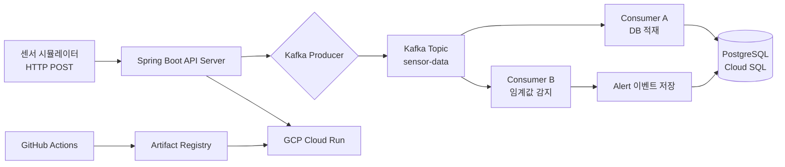
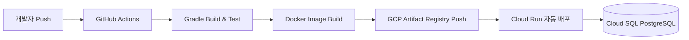

# 🏭 IoT Sensor Monitoring Platform

> 공장/설비 센서 데이터를 실시간으로 수집·적재하고, 이상 감지 시 알림을 발행하는 IoT 모니터링 백엔드 플랫폼

<br>

## 🛠 기술 스택

| 영역 | 기술 |
|---|---|
| Language | Java 17 |
| Framework | Spring Boot 3.x, Spring Security |
| Auth | JWT (JSON Web Token) |
| ORM | Spring Data JPA |
| Message Queue | Apache Kafka |
| Database | PostgreSQL (GCP Cloud SQL) |
| API Docs | Swagger (springdoc-openapi) |
| Test | JUnit5, Mockito |
| Deploy | Docker, GCP Cloud Run |
| CI/CD | GitHub Actions, GCP Artifact Registry |

<br>

## 🏗 아키텍처



<br>

## ⚙️ CI/CD 파이프라인



**GCP 인증 방식:** Workload Identity Federation (서비스 계정 키 없는 안전한 인증)

<br>

## 📌 주요 기능

### 👤 회원 / 인증
- 회원가입 / 로그인 (JWT Access Token 발급)
- Role 기반 접근 제어 (ADMIN / USER)
- Spring Security 필터 체인 구성

### 🔧 센서 장치 관리
- 장치 등록 / 수정 / 삭제 / 목록 조회 (CRUD)
- 장치 타입 분류 (온도 / 진동 / 조도 등)
- 설치 위치 정보 관리

### 📡 실시간 센서 데이터 수신
- HTTP POST 로 센서 데이터 수신
- Kafka Producer 로 `sensor-data` 토픽 발행
- Consumer A: PostgreSQL 실시간 적재
- Consumer B: 임계값 초과 시 Alert 자동 생성

### 🚨 알림 (Alert)
- 장치별 임계값 설정
- 초과 감지 시 Alert 테이블 자동 적재
- 알림 목록 조회 API

<br>

## 🔑 기술적 의사결정

### Kafka를 선택한 이유
단순 HTTP 직접 저장 방식은 대량의 센서 데이터가 동시에 유입될 때 DB 병목이 발생합니다.
Kafka를 도입하여 수신과 적재를 분리함으로써 유입량 급증 시에도 안정적인 처리가 가능하도록 설계했습니다.
실제 제조 설비 데이터 수집 프로젝트(FMEA 시스템) 경험을 바탕으로 동일한 구조를 직접 구현했습니다.

### GCP Cloud Run을 선택한 이유
Kafka Consumer는 항상 실행 중이어야 하지만, API 서버는 트래픽에 따라 유동적으로 운영하는 것이 효율적입니다.
Cloud Run의 서버리스 특성을 활용해 트래픽 기반 자동 스케일링과 비용 최적화를 동시에 달성했습니다.

### Workload Identity Federation을 선택한 이유
기존 서비스 계정 JSON 키 방식은 키 유출 시 보안 리스크가 큽니다.
Workload Identity Federation을 사용하여 GitHub Actions에서 키 없이 GCP 인증을 수행함으로써 보안성을 강화했습니다.

<br>

## 🗂 ERD

```
User
├── id (PK)
├── email (unique)
├── password (BCrypt)
├── role (ADMIN / USER)
└── created_at

Device
├── id (PK)
├── user_id (FK → User)
├── name
├── type (TEMPERATURE / VIBRATION / ILLUMINANCE)
├── location
└── threshold_value  ← 임계값

SensorData
├── id (PK)
├── device_id (FK → Device)
├── value
└── recorded_at

Alert
├── id (PK)
├── device_id (FK → Device)
├── sensor_value     ← 감지 당시 값
├── threshold_value  ← 기준 임계값
├── message
└── created_at
```

<br>

## 🐛 트러블슈팅

> 구현 진행 중 추가 예정

<br>

## 🚀 로컬 실행 방법

### 사전 요구사항
- Java 17
- Docker & Docker Compose
- Gradle

### 실행 순서

```bash
# 1. 레포 클론
git clone https://github.com/{your-username}/iot-sensor-platform.git
cd iot-sensor-platform

# 2. Kafka 실행 (Docker)
docker-compose up -d

# 3. 환경변수 설정
cp .env.example .env
# .env 파일에 DB 정보 입력

# 4. 애플리케이션 실행
./gradlew bootRun --args='--spring.profiles.active=local'
```

### API 명세 확인
```
http://localhost:8080/swagger-ui/index.html
```

<br>

## 📈 향후 확장 계획

```
현재 아키텍처
Kafka → Consumer A → PostgreSQL (실시간 조회용)

확장 계획
Kafka → Consumer A → PostgreSQL     (실시간 모니터링)
      → Consumer B → BigQuery        (대용량 분석/집계)
                         ↓
                   Looker Studio      (시각화 대시보드)
```

Kafka의 컨슈머 그룹 독립성을 활용하여 동일 토픽을 OLTP(PostgreSQL)와 OLAP(BigQuery) 저장소에 동시 적재하는 Lambda Architecture로 확장할 예정입니다.

<br>

## 📁 프로젝트 구조

```
src/main/java/com/bbg/iot_sensor_platform
├── auth/                  # JWT, Security 설정
├── user/                  # 회원 도메인
├── device/                # 센서 장치 도메인
├── sensordata/            # 센서 데이터 수신/적재
├── alert/                 # 알림 도메인
├── kafka/                 # Producer / Consumer
└── global/
    ├── exception/         # 통합 예외처리
    └── config/            # 공통 설정
```
