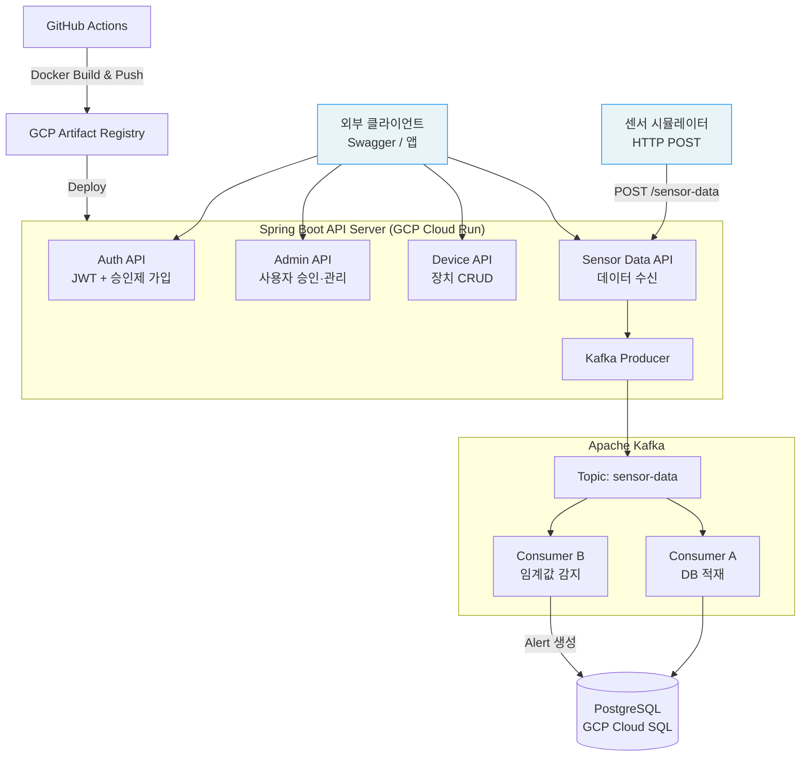
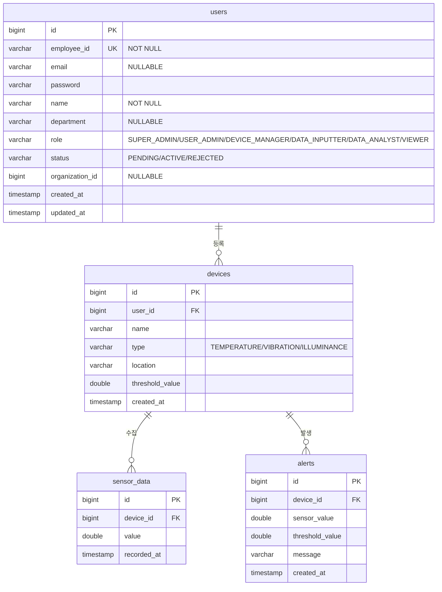

# 🏭 IoT Sensor Platform

> 공장/설비 센서 데이터를 실시간 수집·적재하고 이상 감지 시 알림을 발행하는 IoT 모니터링 백엔드 플랫폼

<br>


-DC382D?style=flat-square&logo=redis&logoColor=white)


<br>

🔗 **배포 URL:** https://iot-sensor-platform-142990968320.asia-northeast3.run.app
📂 **GitHub:** https://github.com/YEONJI-P/iot-sensor-platform

<br>

---

## 📋 목차

1. [프로젝트 소개](#1-프로젝트-소개)
2. [기술 스택](#2-기술-스택)
3. [시스템 아키텍처](#3-시스템-아키텍처)
4. [ERD](#4-erd)
5. [API 명세](#5-api-명세)
6. [주요 기능](#6-주요-기능)
7. [확장 로드맵](#7-확장-로드맵)
8. [실행 방법](#8-실행-방법)

---

## 1. 프로젝트 소개

IoT Sensor Platform은 제조 설비·공장 환경에서 발생하는 센서 데이터를 실시간으로 수집하고, 이상 징후 발생 시 자동으로 알림을 생성하는 **IoT 모니터링 백엔드 플랫폼**입니다.

사번(employeeId) 기반의 **승인제 회원 관리**와 6단계 **역할 기반 접근 제어(RBAC)** 를 통해 조직 내 권한을 세밀하게 관리할 수 있습니다.
Kafka 이벤트 파이프라인으로 대량의 센서 데이터를 안정적으로 처리하며, GCP Cloud Run + Cloud SQL 기반으로 운영됩니다.

<br>

---

## 2. 기술 스택

| 영역 | 기술 |
|---|---|
| Language | Java 17 |
| Framework | Spring Boot 3.x, Spring Security |
| Auth | JWT (JSON Web Token) |
| ORM | Spring Data JPA (Hibernate) |
| Message Queue | Apache Kafka |
| Database | PostgreSQL (GCP Cloud SQL) |
| Cache | Redis *(예정)* |
| API Docs | Swagger (springdoc-openapi) |
| Test | JUnit5, Mockito |
| Infra | GCP Cloud Run, GCP Artifact Registry |
| CI/CD | GitHub Actions, Docker |

<br>

---

## 3. 시스템 아키텍처



<br>

---

## 4. ERD



<br>

---

## 5. API 명세

Swagger UI: `http://localhost:8080/swagger-ui/index.html`

### Auth

| Method | Endpoint | 설명 | 인증 |
|---|---|---|---|
| POST | `/auth/register` | 가입 신청 (status=PENDING) | 불필요 |
| POST | `/auth/login` | 로그인 — ACTIVE 상태만 허용 | 불필요 |

### Admin `USER_ADMIN 이상`

| Method | Endpoint | 설명 | 인증 |
|---|---|---|---|
| GET | `/admin/users` | 전체 사용자 목록 | JWT |
| GET | `/admin/users/pending` | 승인 대기 목록 | JWT |
| PATCH | `/admin/users/{id}/approve` | 가입 승인 → ACTIVE | JWT |
| PATCH | `/admin/users/{id}/reject` | 가입 반려 → REJECTED | JWT |

### Device `인증 필요`

| Method | Endpoint | 설명 | 인증 |
|---|---|---|---|
| GET | `/devices` | 내 장치 목록 | JWT |
| POST | `/devices` | 장치 등록 | JWT |
| PUT | `/devices/{id}` | 장치 수정 | JWT |
| DELETE | `/devices/{id}` | 장치 삭제 | JWT |

### Sensor Data

| Method | Endpoint | 설명 | 인증 |
|---|---|---|---|
| POST | `/sensor-data` | 센서 데이터 수신 (장치 → 서버) | 불필요 |
| GET | `/sensor-data` | 전체 센서 데이터 조회 | JWT |
| GET | `/sensor-data/{deviceId}` | 장치별 센서 데이터 조회 | JWT |

### Alert

| Method | Endpoint | 설명 | 인증 |
|---|---|---|---|
| GET | `/alerts` | 전체 알림 조회 | JWT |
| GET | `/alerts/{deviceId}` | 장치별 알림 조회 | JWT |

### Simulator `인증 필요`

> ⚠️ 시뮬레이터는 포트폴리오 시연 목적의 테스트용 기능입니다. 실제 IoT 센서의 동작을 재현하기 위해 랜덤 센서값을 자동 생성·전송하며, 프로덕션 환경에서의 사용을 목적으로 하지 않습니다.

| Method | Endpoint | 설명 | 인증 |
|---|---|---|---|
| GET | `/simulator/devices` | 시뮬레이션 가능한 장치 목록 | JWT |
| POST | `/simulator/start` | 데이터 자동 생성 시작 | JWT |
| POST | `/simulator/stop` | 데이터 자동 생성 중단 | JWT |

<br>

---

## 6. 주요 기능

### 👤 승인제 사용자 관리
- **사번(employeeId)** 기반 가입 신청 — 가입 즉시 `PENDING` 상태로 저장
- `USER_ADMIN` 이상의 관리자가 승인(`ACTIVE`) 또는 반려(`REJECTED`) 처리
- `PENDING` / `REJECTED` 상태에서 로그인 시 `DisabledException`으로 차단
- **6단계 ROLE 기반 접근 제어**: `SUPER_ADMIN` → `USER_ADMIN` → `DEVICE_MANAGER` → `DATA_INPUTTER` → `DATA_ANALYST` → `VIEWER`
- 앱 최초 기동 시 `SUPER_ADMIN` 계정 자동 생성 (`ADMIN001`)

### 📡 Kafka 기반 이벤트 파이프라인
- 센서 데이터 수신 → Kafka `sensor-data` 토픽 발행
- **Consumer A**: PostgreSQL 실시간 적재
- **Consumer B**: 임계값 초과 감지 → Alert 자동 생성
- 운영 환경(GCP Cloud Run)에서는 Kafka 비활성화 — 직접 저장 방식 사용

### 🤖 IoT 시뮬레이터
- 등록된 장치 선택 후 전송 간격·횟수 설정
- 랜덤 센서값 자동 생성 및 `/sensor-data` 엔드포인트로 자동 전송
- 시뮬레이션 진행 상태 실시간 로그 출력
- 실제 IoT 센서 환경 재현을 위한 포트폴리오 전용 테스트 기능

### 📊 대시보드 *(구현 완료 — 테스트 진행 중)*

> ⚠️ 코드 구현은 완료된 상태이며 현재 테스트 중입니다. 정식 기능으로 안정화되기 전까지 일부 동작이 변경될 수 있습니다.

- 장치별 센서값 라인 차트 시각화
- 알림 발생 현황 바 차트
- JWT 인증 기반 접근 제어

<br>

---

## 7. 확장 로드맵

### ✅ 완료
- JWT 인증 / 인가
- 사번 기반 로그인 + 승인제 가입
- 6단계 ROLE 기반 접근 제어
- Kafka 이벤트 파이프라인 (수신 → 적재 → Alert)
- GCP Cloud Run 배포 + GitHub Actions CI/CD
- **IoT 시뮬레이터 페이지** — 장치 선택 후 랜덤 센서값 자동 생성·전송

### 🔜 예정
- **대시보드 페이지** *(테스트 중)* — 장치별 센서값 라인 차트 / 알림 현황 바 차트
- **Redis RefreshToken** 저장소 — 토큰 갱신 및 로그아웃 처리
- **GCP VM에 Kafka 운영** — Cloud Run 외부 전용 VM 인스턴스에서 Kafka 상시 운영
- **BigQuery + Looker Studio** — 대용량 센서 데이터 분석 및 시각화
- **작업자×환경 vs 품질 상관관계 분석 API** — FMEA 도메인 지식 기반 분석
- **AWS 이전 아키텍처 설계 문서** — 멀티 클라우드 전환 시나리오

```
현재 아키텍처
Kafka → Consumer A → PostgreSQL (실시간 조회)

확장 계획
Kafka → Consumer A → PostgreSQL   (실시간 OLTP)
       → Consumer B → BigQuery     (대용량 OLAP)
                           ↓
                     Looker Studio  (분석 대시보드)
```

<br>

---

## 8. 실행 방법

### 사전 요구사항
- Java 17
- Docker & Docker Compose (PostgreSQL, Kafka 로컬 실행)

### 로컬 실행

```bash
# 1. 레포 클론
git clone https://github.com/YEONJI-P/iot-sensor-platform.git
cd iot-sensor-platform

# 2. PostgreSQL + Kafka 실행
docker-compose up -d

# 3. 애플리케이션 실행
./gradlew bootRun
```

### Swagger UI

```
http://localhost:8080/swagger-ui/index.html
```

### 환경변수

| 변수명 | 설명 | 기본값 |
|---|---|---|
| `DB_URL` | PostgreSQL JDBC URL | `jdbc:postgresql://localhost:5432/iot_sensor_db_v2` |
| `DB_USERNAME` | DB 사용자명 | `postgres` |
| `DB_PASSWORD` | DB 비밀번호 | `postgres` |
| `JWT_SECRET` | JWT 서명 키 (32자 이상) | 개발용 기본값 |
| `KAFKA_BOOTSTRAP_SERVERS` | Kafka 브로커 주소 | `localhost:9092` |

> 초기 관리자 계정: `employeeId=ADMIN001` / `password=admin1234!`
