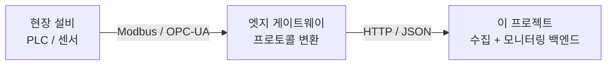
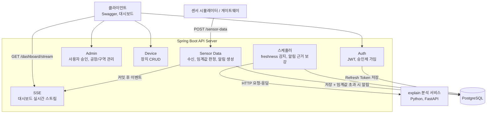
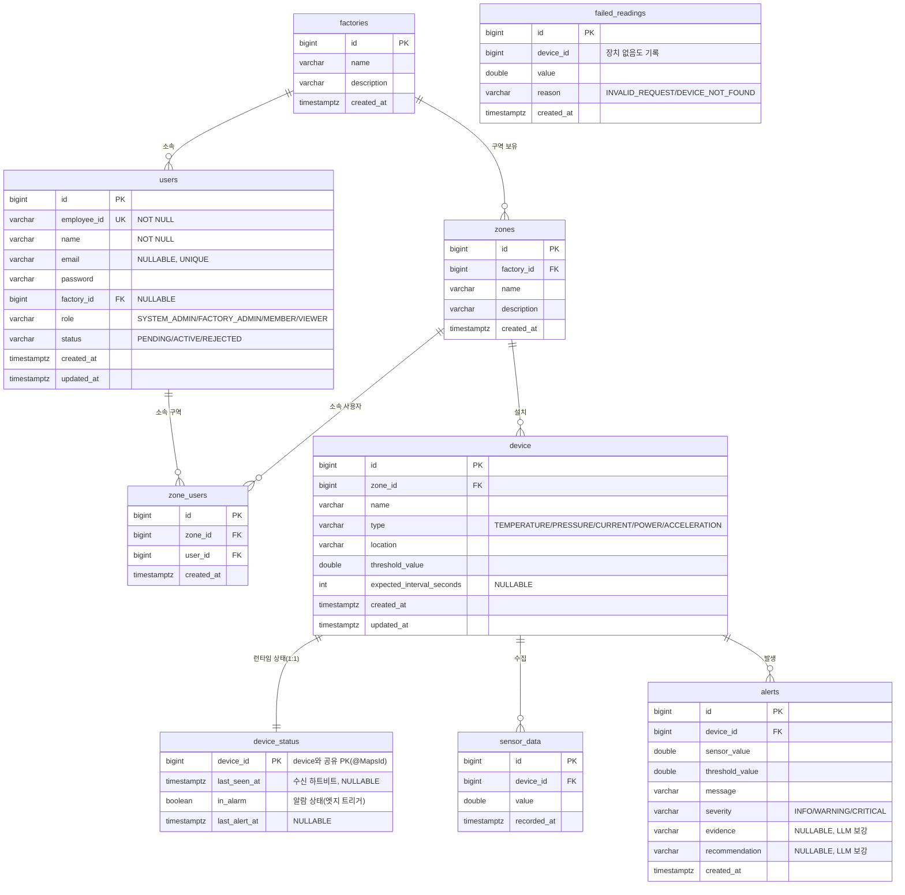
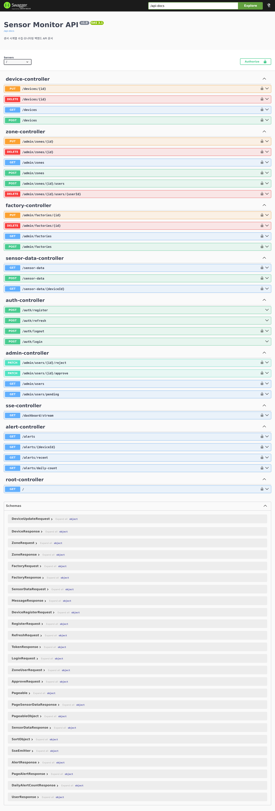
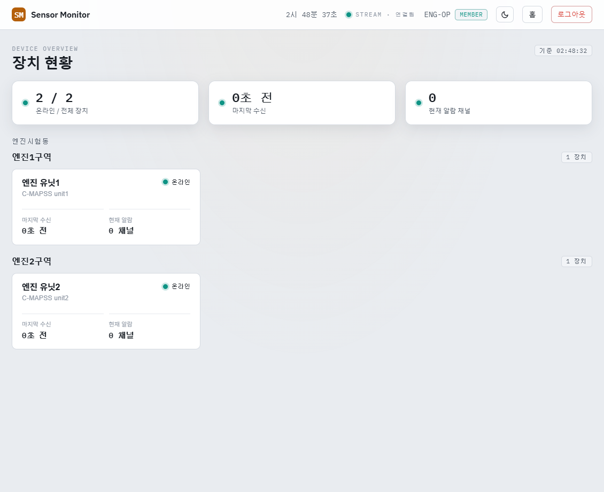

# Sensor Monitor

> 제조 설비 센서 데이터를 수집하고 이상 발생 시 근거와 함께 알림을 생성하는 센서 시계열 수집, 모니터링 백엔드

<br>


<br>

GitHub: https://github.com/YEONJI-P/sensor-monitor

<br>

---

## 목차

1. [프로젝트 소개](#1-프로젝트-소개)
2. [범위와 경계](#2-범위와-경계)
3. [기술 스택](#3-기술-스택)
4. [시스템 아키텍처](#4-시스템-아키텍처)
5. [ERD](#5-erd)
6. [API 명세](#6-api-명세)
7. [주요 기능](#7-주요-기능)
8. [확장 로드맵](#8-확장-로드맵)
9. [실행 방법](#9-실행-방법)
10. [설계 메모](#10-설계-메모)

---

## 1. 프로젝트 소개

제조 설비, 공장 환경에서 발생하는 센서 데이터를 수집하고, 임계값을 벗어난 이상 징후가 보이면 근거와 함께 알림을 생성하는 모니터링 백엔드입니다. 수집한 센서 시계열과 알림 이력은 영속 저장되어 사후 조회할 수 있습니다.

사번(employeeId) 기반의 승인제 회원 관리와 4단계 역할 기반 접근 제어(RBAC)를 통해, 공장, 구역 단위로 접근 범위를 제한합니다.

---

## 2. 범위와 경계

이 프로젝트는 게이트웨이가 HTTP/JSON으로 전달한 센서 데이터를 받아 저장하고 감시하는 백엔드입니다. 현장 프로토콜(Modbus, OPC-UA)의 수집과 변환은 범위 밖입니다.



실제 실시간 센서 대신, 저장된 센서 시계열을 시간 순으로 흘려보내 수신을 재현합니다.

---

## 3. 기술 스택

| 영역 | 기술 |
|---|---|
| Language | Java 17 |
| Framework | Spring Boot 3.x, Spring Security |
| Auth | JWT (JSON Web Token), Refresh Token 회전 |
| ORM | Spring Data JPA (Hibernate) |
| Database | PostgreSQL |
| Realtime | Server-Sent Events (SSE) |
| AI Service | Python 3.11, FastAPI, uv |
| API Docs | Swagger (springdoc-openapi) |
| Test | JUnit5, Mockito, H2(부팅 스모크), Testcontainers(DB 계층), pytest |
| Container | Docker, Docker Compose |
| CI | GitHub Actions |

---

## 4. 시스템 아키텍처

센서 데이터 수신은 별도 메시지 버스 없이 동기 처리합니다. 수신 요청이 들어오면 한 트랜잭션 안에서 센서 데이터를 저장하고, 장치의 마지막 수신 시각을 갱신하고, 임계값 초과를 판정해 알림을 생성합니다. 저장과 알림 이벤트는 트랜잭션 커밋 후 SSE로 대시보드에 실시간 전달됩니다.

주기 스케줄러 두 개가 수신 경로 밖에서 동작합니다. 하나는 기대 수신 주기를 넘긴 침묵 장치를 감지하고, 다른 하나는 생성된 알림의 근거와 권고를 채우기 위해 별도 Python 분석 서비스(explain)를 HTTP로 호출합니다. 이상 탐지는 규칙 기반이고, 설명과 진단만 LLM이 담당합니다.



---

## 5. ERD



---

## 6. API 명세

Swagger UI: `http://localhost:23100/swagger-ui/index.html` (컨테이너 데모는 `8080`)



### Auth

| Method | Endpoint | 설명 | 인증 |
|---|---|---|---|
| POST | `/auth/register` | 가입 신청 (status=PENDING) | 불필요 |
| POST | `/auth/login` | 로그인, ACTIVE 상태만 허용 | 불필요 |
| POST | `/auth/refresh` | Access Token 재발급 | 불필요 |

### Admin (FACTORY_ADMIN 이상)

| Method | Endpoint | 설명 | 인증 |
|---|---|---|---|
| GET | `/admin/users` | 사용자 목록 (FACTORY_ADMIN은 소속 공장만) | JWT |
| GET | `/admin/users/pending` | 승인 대기 목록 (FACTORY_ADMIN은 소속 공장만) | JWT |
| PATCH | `/admin/users/{id}/approve` | 가입 승인 — ACTIVE 전환 + 역할 부여 + 구역 배정 (body: `role`, `zoneIds`) | JWT |
| PATCH | `/admin/users/{id}/reject` | 가입 반려, REJECTED 전환 | JWT |
| GET, POST | `/admin/factories` | 공장 조회, 등록 (SYSTEM_ADMIN) | JWT |
| PUT, DELETE | `/admin/factories/{id}` | 공장 수정, 삭제 (SYSTEM_ADMIN) | JWT |
| GET, POST | `/admin/zones` | 구역 조회, 등록 | JWT |
| PUT, DELETE | `/admin/zones/{id}` | 구역 수정, 삭제 | JWT |
| POST | `/admin/zones/{id}/users` | 구역에 사용자 추가 | JWT |
| DELETE | `/admin/zones/{id}/users/{userId}` | 구역에서 사용자 제거 | JWT |

### Device (조회는 인증, 쓰기는 SYSTEM_ADMIN, FACTORY_ADMIN, MEMBER)

| Method | Endpoint | 설명 | 인증 |
|---|---|---|---|
| GET | `/devices` | 내 장치 목록 | JWT |
| POST | `/devices` | 장치 등록 | JWT |
| PUT | `/devices/{id}` | 장치 수정 | JWT |
| DELETE | `/devices/{id}` | 장치 삭제 | JWT |

### Sensor Data

| Method | Endpoint | 설명 | 인증 |
|---|---|---|---|
| POST | `/sensor-data` | 센서 데이터 수신 (게이트웨이, 장치 to 서버) | 불필요 |
| GET | `/sensor-data` | 전체 센서 데이터 조회 (페이지네이션, `?page=&size=&sort=`) | JWT |
| GET | `/sensor-data/{deviceId}` | 장치별 센서 데이터 조회 | JWT |

### Alert

| Method | Endpoint | 설명 | 인증 |
|---|---|---|---|
| GET | `/alerts` | 전체 알림 조회 (페이지네이션, `?page=&size=&sort=`) | JWT |
| GET | `/alerts/{deviceId}` | 장치별 알림 조회 | JWT |
| GET | `/alerts/recent?deviceId=&limit=` | 장치별 최근 알림 (대시보드) | JWT |
| GET | `/alerts/daily-count?deviceId=&days=` | 장치별 일자별 알림 수 (대시보드) | JWT |

### 실시간 스트림 (SSE)

| Method | Endpoint | 설명 | 인증 |
|---|---|---|---|
| GET | `/dashboard/stream?token=` | 접근 범위 내 센서, 알림 이벤트 실시간 스트림 | 쿼리 토큰 |

> EventSource가 헤더를 못 실어 Access Token을 쿼리로 받습니다. 구독자는 자신의 접근 가능 장치로 이벤트가 필터링됩니다.

### explain 분석 서비스 (Python, 로컬 `http://localhost:23200` · 컨테이너 데모 `8000`)

Spring이 스케줄러에서 HTTP로 호출하는 별도 서비스입니다. 탐지는 Spring의 규칙이 담당하고, 이 서비스는 설명과 진단만 생성합니다.

| Method | Endpoint | 설명 |
|---|---|---|
| POST | `/explain/anomaly` | 알림 근거(evidence)와 권고(recommendation) 생성 |
| POST | `/explain/freshness` | 장치 침묵 원인 진단 |

> LLM provider는 인터페이스로 분리돼 있습니다. 기본값은 키가 필요 없는 `echo`이고, 환경변수로 `gemini`로 교체할 수 있습니다.

---

## 7. 주요 기능

실시간 대시보드 — SSE로 센서값이 실시간 갱신되고, 임계값 초과 알림에는 LLM(explain 서비스)이 생성한 근거·권고가 붙습니다.



### 승인제 사용자 관리와 접근 제어

- 사번(employeeId) 기반 가입 신청, 가입 즉시 `PENDING` 상태로 저장
- `FACTORY_ADMIN` 이상의 관리자가 승인 또는 반려(`REJECTED`) 처리. 승인 시 `ACTIVE` 전환과 함께 역할 부여, 소속 구역 배정을 한 트랜잭션에서 수행
- `FACTORY_ADMIN`은 자신의 소속 공장 사용자만 조회, 승인할 수 있고 (`SYSTEM_ADMIN`은 전체), 부여 가능한 역할도 자기 역할 이하로 제한
- `PENDING`, `REJECTED` 상태에서 로그인 시 `DisabledException`으로 차단
- 4단계 역할 기반 접근 제어

  | 역할 | 범위 |
  |---|---|
  | `SYSTEM_ADMIN` | 전체 공장, 장치 |
  | `FACTORY_ADMIN` | 소속 공장의 구역, 장치, 사용자 관리 |
  | `MEMBER` | 소속 구역 읽기, 쓰기 (장치 관리) |
  | `VIEWER` | 소속 구역 읽기 전용 (장치 변경 불가) |

- 공장(Factory), 구역(Zone) 계층과 구역 소속 관계로 접근 범위를 계산하는 `AccessControlService`
- 초기 데이터는 `services/simulator/seed.sql`(PostgreSQL) 일괄 투입

### 센서 데이터 수신과 알림

- `POST /sensor-data` 수신 시 한 트랜잭션에서 센서 데이터 저장, 장치 수신 시각 갱신, 임계값 초과 판정, 알림 생성
- 알림은 **엣지 트리거**로 생성 — 정상에서 임계값 초과로 넘어가는 순간 한 건만 만들고, 초과가 지속되는 동안은 억제합니다. 값이 임계값 아래(히스테리시스 밴드)로 복귀하면 알람을 해제해 다음 초과를 다시 감지합니다. 초과가 지속되는 구간에서 같은 사건이 수십 건으로 도배되는 것을 막습니다
- severity는 초과 폭으로 판정(임계값 대비 여유가 크면 `CRITICAL`). 장치 런타임 상태(알람 여부·마지막 수신 시각)는 설정과 분리해 `device_status` 테이블에서 관리
- 별도 메시지 버스 없이 동기 처리 (설계 근거는 아래 설계 메모 참고)
- 이상 판정은 `AnomalyDetector` 전략 인터페이스로 분리(현재 `ThresholdDetector`), 판정 로직 교체 가능
- 검증 실패, 미등록 장치 요청은 조용히 버리지 않고 `failed_readings`에 사유와 함께 적재
- 알림은 severity(INFO/WARNING/CRITICAL)와 근거(evidence), 권고(recommendation) 필드를 가지며, 근거와 권고는 explain 서비스가 사후 보강

### 장치 freshness 감지

- 장치 설정에 기대 수신 주기(`expectedIntervalSeconds`)를 두고, 마지막 수신 시각(`lastSeenAt`)은 런타임 상태라 `device_status`에 두어 수신마다 갱신
- 주기 스케줄러가 기대 주기를 넘겨 침묵한 장치를 감지 (데이터가 안 오는 상황을 신호로 포착)
- 같은 구역 장치가 동시에 침묵하면 사이트 사건(계획 정지, 게이트웨이 장애)으로 보고 구역 한 건으로 집계(`WARNING`), 이웃이 정상 수신 중인데 단독 침묵하면 개별 고장으로 `CRITICAL` + explain 원인진단

### LLM 기반 이상 설명 (explain 서비스)

- 별도 Python/FastAPI 서비스가 알림 근거, 권고와 침묵 원인 진단을 생성
- 탐지는 규칙, 설명과 진단만 LLM이 담당
- provider를 인터페이스로 분리해 LLM 교체 가능(기본 `echo`, `gemini` 선택)

### 인증

- JWT 기반 stateless 인증, Refresh Token 은 PostgreSQL 에 저장
- Refresh Token 회전, 불일치 시 저장 토큰을 삭제해 강제 로그아웃 처리
- Access, Refresh 토큰에 `type` 클레임을 두어 Refresh 토큰으로는 API에 접근 불가

### 센서 시뮬레이터 (`services/simulator/simulator.py`)

- 실제 센서처럼 서버 외부에서 `POST /sensor-data`를 직접 호출
- 공개 실측 시계열(C-MAPSS 엔진, CNC 밀링)을 시간 순으로 리플레이, seed의 device 채널과 1:1 매핑
- 대상 채널, 전송 간격(초), 행 수를 CLI 인자로 지정

### 실시간 대시보드

- 장치별 센서값 라인 차트, 알림 현황 시각화
- SSE(`/dashboard/stream`) 구독으로 수신, 알림 이벤트를 실시간 반영

---

## 8. 확장 로드맵

### 완료

- JWT 인증, 인가, 사번 기반 로그인, 승인제 가입
- 4단계 역할 기반 접근 제어, 공장, 구역 계층 접근 제어
- 가입 승인 워크플로 (역할 부여 + 구역 배정, FACTORY_ADMIN 소속 공장 스코핑)
- 동기 센서 수신 파이프라인 (수신, 저장, 임계값 판정, 알림)
- 이상 판정 로직 전략화 (`AnomalyDetector` 인터페이스로 분리)
- 알림 스키마 확장 (severity, 근거, 권고 필드)와 실패 수신 적재
- 장치 freshness 감지 (구역 코호트 판정으로 오탐 억제, 침묵 원인 explain 진단)
- SSE 기반 실시간 대시보드 (접근 범위 스코핑)
- LLM 기반 이상 근거, 원인 진단 (Python 분석 서비스 HTTP 연동)
- 실측 공개 센서 시계열(C-MAPSS 엔진, CNC 밀링) 리플레이로 시뮬레이터 데이터 교체
- Refresh Token 저장·회전 (PostgreSQL)

### 향후

- explain provider Gemini 실호출 (현재 기본 `echo`, 키 주입 시 전환)
- MQTT 수신 경로 도입 (엣지 게이트웨이와의 표준 연동)
- 대용량 시계열 저장소(TimescaleDB) 검토

---

## 9. 실행 방법

### 사전 요구사항

- Java 17
- 아래 두 모드 중 하나
  - **로컬 실행**: 공용 PostgreSQL 인스턴스(이 저장소 밖에서 실행, DB·계정 `sensor_monitor`)
  - **컨테이너 데모**: Docker, Docker Compose (자체 Postgres 포함, compose 하나로 전체 기동)

### 로컬 실행 (공용 Postgres + bootRun)

일상 개발용. 공용 Postgres 를 쓰고 backend 만 로컬에서 띄운다.

```bash
git clone https://github.com/YEONJI-P/sensor-monitor.git
cd sensor-monitor

# 공용 PostgreSQL 준비 — DB·사용자 sensor_monitor 가 실행 중이어야 함
# (앱 기본값이 jdbc:postgresql://localhost:5432/sensor_monitor 를 가리킴)

# JWT 서명 키 설정, 기본값이 없어 미설정 시 부팅 실패 (셸 export 또는 IDE 실행 구성)
export JWT_SECRET=$(head -c 48 /dev/urandom | base64)

# 애플리케이션 실행 (Spring은 services/backend/)
cd services/backend
./gradlew bootRun

# (선택) explain 분석 서비스만 컨테이너로: 루트에서 docker compose up -d explain
```

> 공용 Postgres 가 기본 접속정보와 다르면 `DB_URL`·`DB_USERNAME`·`DB_PASSWORD` 를 셸 env 로 재정의합니다. Spring 은 `.env` 를 자동 로드하지 않으므로 위 값은 셸/IDE 에 직접 주입합니다.

### 컨테이너 데모 (`docker compose up`)

평가자·데모용. postgres + backend + explain 을 한 번에 기동한다. 공용 DB 불필요.

```bash
cp .env.example .env          # JWT_SECRET 등 채우기 (compose 가 자동 로드)
docker compose up --build     # postgres + backend + explain

# 초기 데이터(계정/장치/임계값) 적재
docker compose exec -T postgres psql -U sensor_monitor -d sensor_monitor < services/simulator/seed.sql

# (선택) 실측 CSV 리플레이 배치 — seed 프로파일
docker compose --profile seed run --rm simulator --all
```

> 컨테이너 postgres 는 호스트 `5433` 에 노출됩니다(공용 `5432` 와 충돌 방지). backend 는 내부 네트워크(`postgres:5432`)로 접속하므로 `DB_*` 재정의는 필요 없습니다. 리플레이 데이터(`services/simulator/data/`)는 저장소에 포함되지 않으니 먼저 내려받아야 합니다.

### 테스트 실행

```bash
cd services/backend
./gradlew test
```

> 테스트는 두 갈래입니다.
> - **컨텍스트 부팅 스모크**(`contextLoads`)는 인메모리 H2 로 동작해 별도 인프라 없이 실행됩니다(엔티티 매핑·설정 오류를 싸게 잡는 용도이며, DB 계층은 검증하지 않습니다). 설정은 `services/backend/src/test/resources/application.yml`.
> - **DB 계층 검증**(리포지토리·네이티브 쿼리·제약·컬럼 타입)은 Testcontainers 로 프로덕션과 동일한 `postgres:15` 를 띄워 검증하므로 **로컬에 도커가 실행 중이어야 합니다**. 컨테이너는 한 번만 떠서 모든 리포지토리 테스트가 재사용합니다.

### Swagger UI

```
http://localhost:23100/swagger-ui/index.html
```

> bootRun 기본 포트는 `23100`. 컨테이너 데모(`docker compose up`)는 호스트 `8080`을 유지합니다.

### 초기 데이터 투입 (`services/simulator/seed.sql`)

Spring Boot 기동 후 테이블이 생성된 상태에서 실행합니다.

```bash
psql -U sensor_monitor -d sensor_monitor -f services/simulator/seed.sql
```

> 재실행이 필요한 경우 `seed.sql` 하단의 `TRUNCATE` 주석을 해제 후 먼저 실행하세요.

투입되는 샘플 계정

| employeeId | 이름 | Role | password |
|---|---|---|---|
| `SYSTEM` | 시스템 관리자 | SYSTEM_ADMIN | `admin1234!` |
| `ENG-ADMIN` | 엔진동 관리자 | FACTORY_ADMIN | `admin1234!` |
| `CNC-ADMIN` | 가공동 관리자 | FACTORY_ADMIN | `admin1234!` |
| `ENG-OP` | 엔진동 설비담당 | MEMBER | `op1234!` |
| `CNC-OP` | 가공동 설비담당 | MEMBER | `op1234!` |
| `ENG-VIEW` | 엔진동 열람 | VIEWER | `view1234!` |
| `CNC-VIEW` | 가공동 열람 | VIEWER | `view1234!` |

### 센서 시뮬레이터 실행 (`services/simulator/simulator.py`)

실측 공개 데이터(C-MAPSS, CNC)를 시간 순으로 리플레이해 `POST /sensor-data`로 전송합니다. seed의 device(채널)와 1:1로 매핑됩니다.

```bash
# 1. 데이터 내려받기 (최초 1회)
bash services/simulator/data/download.sh

# 2. 의존성 설치
pip install requests

# 3. 전체 7개 채널 리플레이 (1초 간격)
python services/simulator/simulator.py --all

# 특정 채널만 / 간격, 행수 조절
python services/simulator/simulator.py --devices 1 6 --interval 0.5 --limit 100
```

> device id는 seed.sql의 device 삽입 순서와 일치합니다(1~4 = C-MAPSS 엔진, 5~7 = CNC 밀링).

### 환경변수

| 변수명 | 설명 | 기본값 |
|---|---|---|
| `DB_URL` | PostgreSQL JDBC URL | `jdbc:postgresql://localhost:5432/sensor_monitor` |
| `DB_USERNAME` | DB 사용자명 | `sensor_monitor` |
| `DB_PASSWORD` | DB 비밀번호 | `sensor_monitor` |
| `JWT_SECRET` | JWT 서명 키 (32자 이상) | 없음 (필수), 미설정 시 부팅 실패 |

---

## 10. 설계 메모

### 메시지 버스 제거

소비자가 하나라 메시지 버스(Kafka)를 두지 않고 수신을 동기 처리(저장, 임계값 판정, 알림 생성)로 했습니다. 다중 소비자가 필요해지면 다시 검토합니다.

### 접근 제어 계층

공장(Factory), 구역(Zone), 구역 소속(ZoneUser) 3계층으로 접근 범위를 계산합니다. `SYSTEM_ADMIN`은 전체, `FACTORY_ADMIN`은 소속 공장, `MEMBER`와 `VIEWER`는 소속 구역으로 범위가 좁혀지며, `VIEWER`는 읽기 전용으로 장치 변경이 차단됩니다.

### freshness 오탐 억제

센서는 정상적으로도 조용해집니다(계획 정지, 비가동, 점검). 침묵을 모두 알림으로 올리면 공장이 문을 닫을 때 장치 수만큼 알림이 쏟아집니다. 그래서 같은 구역 장치가 동시에 침묵하면 사이트 단위 사건으로 보고 한 건으로 묶고(`WARNING`), 이웃은 정상 수신 중인데 혼자 침묵할 때만 개별 고장으로 `CRITICAL` + explain 원인진단을 붙입니다.

### explain 분석 서비스

이상 탐지는 임계값 규칙으로 하고, LLM은 근거 설명과 침묵 원인 진단에만 씁니다. 에이전트 프레임워크 없이 LLM API를 직접 호출합니다. 이 호출은 수신 경로 밖 스케줄러에서만 일어나 수신에 영향을 주지 않습니다. provider는 인터페이스로 분리해 교체할 수 있습니다.

### 검토 중

- DeviceType이 Enum 하드코딩이라 타입 추가 시 빌드가 필요합니다. 외부 설정화는 검토 중입니다.
