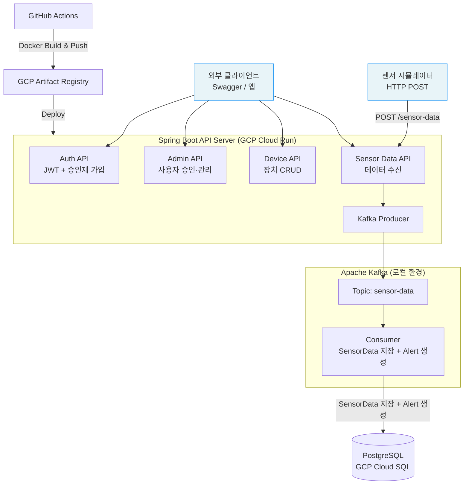
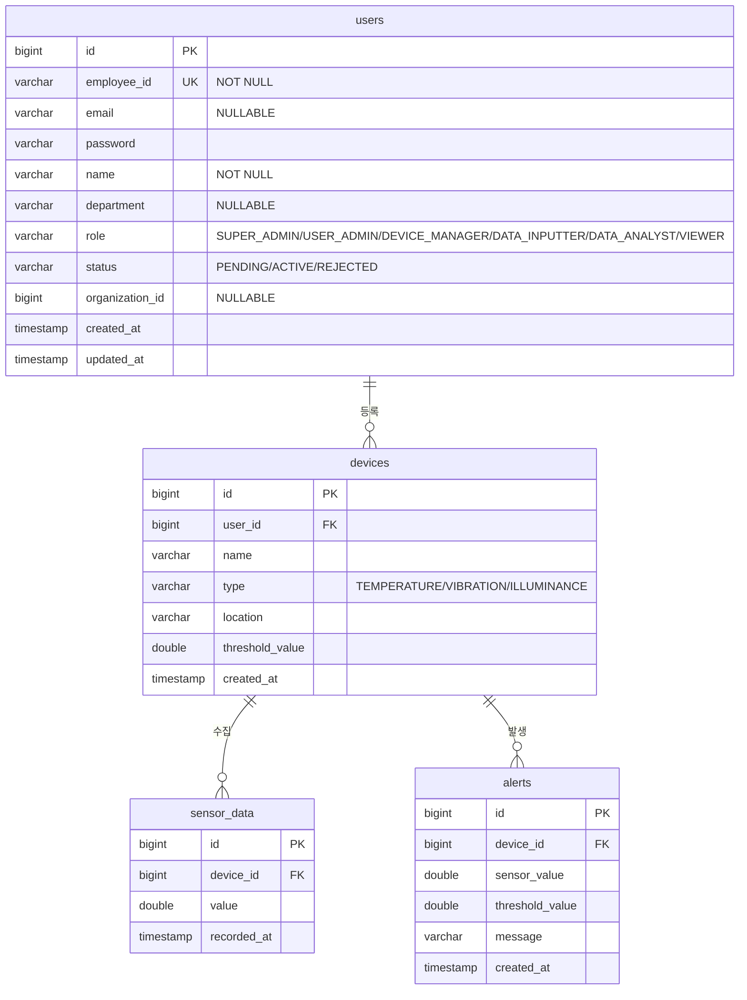

# 🏭 IoT Sensor Platform

> 공장/설비 센서 데이터를 실시간 수집·적재하고 이상 감지 시 알림을 발행하는 IoT 모니터링 백엔드 플랫폼

<br>


-DC382D?style=flat-square&logo=redis&logoColor=white)


<br>

🔗 **배포 URL:** https://iot-sensor-platform-142990968320.asia-northeast3.run.app
📂 **GitHub:** https://github.com/YEONJI-P/iot-sensor-platform

<br>

---

## 📋 목차

1. [프로젝트 소개](#1-프로젝트-소개)
2. [기술 스택](#2-기술-스택)
3. [시스템 아키텍처](#3-시스템-아키텍처)
4. [ERD](#4-erd)
5. [API 명세](#5-api-명세)
6. [주요 기능](#6-주요-기능)
7. [확장 로드맵](#7-확장-로드맵)
8. [실행 방법](#8-실행-방법)

---

## 1. 프로젝트 소개

IoT Sensor Platform은 제조 설비·공장 환경에서 발생하는 센서 데이터를 실시간으로 수집하고, 이상 징후 발생 시 자동으로 알림을 생성하는 **IoT 모니터링 백엔드 플랫폼**입니다.

사번(employeeId) 기반의 **승인제 회원 관리**와 6단계 **역할 기반 접근 제어(RBAC)** 를 통해 조직 내 권한을 세밀하게 관리할 수 있습니다.
Kafka 이벤트 파이프라인으로 대량의 센서 데이터를 안정적으로 처리하며, GCP Cloud Run + Cloud SQL 기반으로 운영됩니다.

<br>

---

## 2. 기술 스택

| 영역 | 기술 |
|---|---|
| Language | Java 17 |
| Framework | Spring Boot 3.x, Spring Security |
| Auth | JWT (JSON Web Token) |
| ORM | Spring Data JPA (Hibernate) |
| Message Queue | Apache Kafka |
| Database | PostgreSQL (GCP Cloud SQL) |
| Cache | Redis *(예정)* |
| API Docs | Swagger (springdoc-openapi) |
| Test | JUnit5, Mockito |
| Infra | GCP Cloud Run, GCP Artifact Registry |
| CI/CD | GitHub Actions, Docker |

<br>

---

## 3. 시스템 아키텍처



<br>

---

## 4. ERD



<br>

---

## 5. API 명세

Swagger UI: `http://localhost:8080/swagger-ui/index.html`

### Auth

| Method | Endpoint | 설명 | 인증 |
|---|---|---|---|
| POST | `/auth/register` | 가입 신청 (status=PENDING) | 불필요 |
| POST | `/auth/login` | 로그인 — ACTIVE 상태만 허용 | 불필요 |

### Admin `USER_ADMIN 이상`

| Method | Endpoint | 설명 | 인증 |
|---|---|---|---|
| GET | `/admin/users` | 전체 사용자 목록 | JWT |
| GET | `/admin/users/pending` | 승인 대기 목록 | JWT |
| PATCH | `/admin/users/{id}/approve` | 가입 승인 → ACTIVE | JWT |
| PATCH | `/admin/users/{id}/reject` | 가입 반려 → REJECTED | JWT |

### Device `인증 필요`

| Method | Endpoint | 설명 | 인증 |
|---|---|---|---|
| GET | `/devices` | 내 장치 목록 | JWT |
| POST | `/devices` | 장치 등록 | JWT |
| PUT | `/devices/{id}` | 장치 수정 | JWT |
| DELETE | `/devices/{id}` | 장치 삭제 | JWT |

### Sensor Data

| Method | Endpoint | 설명 | 인증 |
|---|---|---|---|
| POST | `/sensor-data` | 센서 데이터 수신 (장치 → 서버) | 불필요 |
| GET | `/sensor-data` | 전체 센서 데이터 조회 | JWT |
| GET | `/sensor-data/{deviceId}` | 장치별 센서 데이터 조회 | JWT |

### Alert

| Method | Endpoint | 설명 | 인증 |
|---|---|---|---|
| GET | `/alerts` | 전체 알림 조회 | JWT |
| GET | `/alerts/{deviceId}` | 장치별 알림 조회 | JWT |

### ~~Simulator~~ `삭제 예정`

> ~~⚠️ 시뮬레이터는 포트폴리오 시연 목적의 테스트용 기능입니다. 실제 IoT 센서의 동작을 재현하기 위해 랜덤 센서값을 자동 생성·전송하며, 프로덕션 환경에서의 사용을 목적으로 하지 않습니다.~~

> 🔧 **인앱 시뮬레이터는 서버에서 분리 예정입니다.** 서버 내부에 시뮬레이터를 두는 구조 대신, 별도 Python 스크립트(`iot/simulator.py`)가 실제 IoT 센서처럼 `POST /sensor-data`를 직접 호출하는 방식으로 전환합니다. 아래 API는 해당 전환 완료 후 제거됩니다.

| Method | Endpoint | 설명 | 인증 |
|---|---|---|---|
| ~~GET~~ | ~~`/simulator/devices`~~ | ~~시뮬레이션 가능한 장치 목록~~ | ~~JWT~~ |
| ~~POST~~ | ~~`/simulator/start`~~ | ~~데이터 자동 생성 시작~~ | ~~JWT~~ |
| ~~POST~~ | ~~`/simulator/stop`~~ | ~~데이터 자동 생성 중단~~ | ~~JWT~~ |

<br>

---

## 6. 주요 기능

### 👤 승인제 사용자 관리
- **사번(employeeId)** 기반 가입 신청 — 가입 즉시 `PENDING` 상태로 저장
- `USER_ADMIN` 이상의 관리자가 승인(`ACTIVE`) 또는 반려(`REJECTED`) 처리
- `PENDING` / `REJECTED` 상태에서 로그인 시 `DisabledException`으로 차단
- **6단계 ROLE 기반 접근 제어**: `SUPER_ADMIN` → `USER_ADMIN` → `DEVICE_MANAGER` → `DATA_INPUTTER` → `DATA_ANALYST` → `VIEWER`
- ~~앱 최초 기동 시 `SUPER_ADMIN` 계정 자동 생성 (`ADMIN001`) — `DataInitializer`~~ → `iot/seed.sql`로 대체 (PostgreSQL native query로 초기 데이터 일괄 투입)

### 📡 Kafka 기반 이벤트 파이프라인
- 센서 데이터 수신 → Kafka `sensor-data` 토픽 발행
- 단일 Consumer가 SensorData 저장 + 임계값 초과 감지 → Alert 생성을 순차 처리
- 운영 환경(GCP Cloud Run)에서는 Kafka 비활성화 — 직접 저장 방식 사용

### ~~🤖 IoT 시뮬레이터 (인앱)~~ `삭제 예정`
> 서버 내부 시뮬레이터는 아래와 같이 별도 Python 스크립트로 전환됩니다.

~~- 등록된 장치 선택 후 전송 간격·횟수 설정~~
~~- 랜덤 센서값 자동 생성 및 `/sensor-data` 엔드포인트로 자동 전송~~
~~- 시뮬레이션 진행 상태 실시간 로그 출력~~
~~- 실제 IoT 센서 환경 재현을 위한 포트폴리오 전용 테스트 기능~~

### 🤖 IoT 시뮬레이터 (외부 스크립트) `iot/simulator.py`
- 실제 IoT 센서처럼 서버 외부에서 `POST /sensor-data`를 직접 호출
- 장치 ID, 전송 간격(초), 횟수를 CLI 인자로 지정
- 임계값 기준 랜덤 센서값 생성 (정상값 80% / 초과값 20%)
- 인증 없이 동작 (센서 데이터 수신 엔드포인트는 public)

### 📊 대시보드 *(구현 완료 — 테스트 진행 중)*

> ⚠️ 코드 구현은 완료된 상태이며 현재 테스트 중입니다. 정식 기능으로 안정화되기 전까지 일부 동작이 변경될 수 있습니다.

- 장치별 센서값 라인 차트 시각화
- 알림 발생 현황 바 차트
- JWT 인증 기반 접근 제어

<br>

---

## 7. 확장 로드맵

### ✅ 완료
- JWT 인증 / 인가
- 사번 기반 로그인 + 승인제 가입
- 6단계 ROLE 기반 접근 제어
- Kafka 이벤트 파이프라인 (수신 → 적재 → Alert)
- GCP Cloud Run 배포 + GitHub Actions CI/CD
- ~~**IoT 시뮬레이터 페이지 (인앱)**~~ — 별도 Python 스크립트(`iot/simulator.py`)로 전환

### 🔜 예정
- **인앱 시뮬레이터 코드 삭제** — `simulator/` 패키지 및 관련 API 제거
- **대시보드 페이지** *(테스트 중)* — 장치별 센서값 라인 차트 / 알림 현황 바 차트
- **Redis RefreshToken** 저장소 — 토큰 갱신 및 로그아웃 처리
- **GCP VM에 Kafka 운영** — Cloud Run 외부 전용 VM 인스턴스에서 Kafka 상시 운영. 로컬·prod 모두 동일 브로커 사용 가능
- **BigQuery 연동** — 별도 Consumer Group(`bigquery-group`) 추가로 동일 토픽을 독립 구독, 대용량 센서 데이터를 BigQuery에 적재
- **AWS 이전 아키텍처 설계 문서** — 멀티 클라우드 전환 시나리오

```
현재 구조 (단일 Consumer)
Kafka → iot-sensor-group → SensorData 저장 + Alert 생성 → PostgreSQL

BigQuery 연동 후 구조 (Consumer Group 분리, 미구현)
Kafka → iot-sensor-group → SensorData 저장 + Alert 생성 → PostgreSQL  (실시간 OLTP)
     → bigquery-group   → BigQuery INSERT               → BigQuery    (대용량 OLAP)
```

<br>

---

## 8. 실행 방법

### 사전 요구사항
- Java 17
- Docker & Docker Compose (PostgreSQL, Kafka 로컬 실행)

### 로컬 실행

```bash
# 1. 레포 클론
git clone https://github.com/YEONJI-P/iot-sensor-platform.git
cd iot-sensor-platform

# 2. PostgreSQL + Kafka 실행
docker-compose up -d

# 3. 애플리케이션 실행
./gradlew bootRun
```

### Swagger UI

```
http://localhost:8080/swagger-ui/index.html
```

### 초기 데이터 투입 (`iot/seed.sql`)

Spring Boot 기동 후 테이블이 생성된 상태에서 실행합니다.

**로컬 DB**
```bash
psql -U postgres -d iot_sensor_db_v2 -f iot/seed.sql
```

**Cloud SQL (Cloud SQL Auth Proxy)**
```bash
# 1. Proxy 기동
cloud-sql-proxy <INSTANCE_CONNECTION_NAME> --port 5433

# 2. 실행
psql "host=127.0.0.1 port=5433 dbname=iot_sensor_db_v2 user=postgres" -f iot/seed.sql
```

**Cloud SQL (gcloud CLI)**
```bash
gcloud sql connect <INSTANCE_NAME> --user=postgres --database=iot_sensor_db_v2
# 접속 후: \i iot/seed.sql
```

> 재실행이 필요한 경우 `seed.sql` 하단의 `TRUNCATE` 주석을 해제 후 먼저 실행하세요.

**투입되는 샘플 계정**

| employeeId | 이름 | Role | password |
|---|---|---|---|
| `ADMIN001` | 슈퍼관리자 | SUPER_ADMIN | `admin1234!` |
| `MGR001` | 공장A-관리자 | USER_ADMIN | `mgr1234!` |
| `MGR002` | 공장B-관리자 | USER_ADMIN | `mgr1234!` |
| `DEV001` | 장치담당자A | DEVICE_MANAGER | `dev1234!` |
| `INP001` | 데이터입력자A1 | DATA_INPUTTER | `inp1234!` |
| `ANL001` | 분석담당자A | DATA_ANALYST | `anl1234!` |
| `VWR001` | 열람자A | VIEWER | `vwr1234!` |

### IoT 시뮬레이터 실행 (`iot/simulator.py`)

```bash
# 의존성 설치
pip install requests

# 기본 실행 (장치 ID=1, 10회, 2초 간격, 임계값 80)
python iot/simulator.py --device-id 1 --count 10 --interval 2 --threshold 80

# 배포 서버 대상
python iot/simulator.py --device-id 1 --count 20 --interval 1 --threshold 80 \
  --base-url https://iot-sensor-platform-142990968320.asia-northeast3.run.app
```

> seed.sql로 투입된 장치의 ID를 확인하여 `--device-id`에 지정하세요.

### Kafka 동작 확인 (로컬 전용)

배포 서버(Cloud Run)에서는 Kafka가 비활성화되어 있습니다. Kafka 파이프라인을 테스트하려면 로컬에서 기본 프로파일로 실행해야 합니다.

```bash
# Kafka + PostgreSQL 기동
docker-compose up -d

# 기본 프로파일로 실행 (Kafka 활성화)
./gradlew bootRun
```

### 환경변수

| 변수명 | 설명 | 기본값 |
|---|---|---|
| `DB_URL` | PostgreSQL JDBC URL | `jdbc:postgresql://localhost:5432/iot_sensor_db_v2` |
| `DB_USERNAME` | DB 사용자명 | `postgres` |
| `DB_PASSWORD` | DB 비밀번호 | `postgres` |
| `JWT_SECRET` | JWT 서명 키 (32자 이상) | 개발용 기본값 |
| `KAFKA_BOOTSTRAP_SERVERS` | Kafka 브로커 주소 | `localhost:9092` |

> ~~초기 관리자 계정 자동 생성 (DataInitializer)~~ → `iot/seed.sql` 실행으로 투입. 계정: `employeeId=ADMIN001` / `password=admin1234!`


## 9. 설계 메모

### 완료된 결정

- **인앱 시뮬레이터 분리:** 서버 내부 `simulator/` 패키지를 삭제하고, 별도 Python 스크립트(`iot/simulator.py`)가 `POST /sensor-data`를 직접 호출하는 방식으로 전환. 실제 외부 센서 환경에 가까운 구조로 변경
- **본질에 집중하기:** 시뮬레이터 같은 부수적인 기능은 쳐내고, 데이터 관리·트래픽 처리에 집중하는 구조로 변경
- **초기 데이터 투입 방식 변경:** `DataInitializer`(Spring Boot 기동 시 자동 생성)를 삭제하고 `iot/seed.sql`(PostgreSQL native query)로 대체. SUPER_ADMIN 포함 전체 샘플 데이터를 SQL로 일괄 투입
- **Consumer 실제 구조 확인:** README 아키텍처 다이어그램에서 Consumer A/B 2개로 표현했으나, 실제 코드는 단일 `@KafkaListener` 안에서 SensorData 저장과 Alert 생성을 순차 처리하는 구조. 다이어그램을 실제 구조에 맞게 수정

### 검토 중 / 예정

- **SensorType 동적 구성 검토:** 현재 SensorType(`TEMPERATURE`, `VIBRATION`, `ILLUMINANCE`, `PRESSURE`)이 Enum으로 하드코딩되어 있어 타입 추가·변경 시 빌드가 필요함. JSON/YAML 등 외부 파일로 관리하거나 CRUD API를 두는 방식이 적합한지 검토 필요. UserRole·UserStatus는 각 값마다 인가 로직·상태 전이가 코드에 묶여 있어 Enum이 적합하나, SensorType은 임계값 초과 감지 로직이 타입에 무관하게 동일하므로 외부화 여지 있음
- **Kafka 운영 환경 통합:** 현재 prod(Cloud Run)에서는 Kafka 비활성화, 로컬에서만 동작. GCP VM에 Kafka 상시 운영 시 로컬·prod 모두 동일 브로커를 사용할 수 있어 환경 차이가 줄어듦. 이 경우 프로파일 분리의 실질적 이유는 Cloud SQL 소켓팩토리 설정 정도만 남게 됨 *(미구현, 로드맵 예정)*
- **BigQuery 연동 시 Consumer 확장:** 기존 Consumer(`iot-sensor-group`)를 수정하지 않고 별도 Consumer Group(`bigquery-group`)을 추가해 동일 토픽을 독립 구독하는 방식으로 확장 예정. 두 그룹이 독립적으로 모든 메시지를 수신하므로 기존 코드 변경 없이 Consumer 클래스 추가만으로 확장 가능 *(미구현, 로드맵 예정)*
- **로컬 DB vs Cloud SQL:** 로컬 개발은 로컬 DB 유지. 로컬에서 Cloud SQL 직접 연결 시 배포 데이터 오염 위험·개발 속도 저하·상시 비용 등의 이유로 분리 유지 결정
