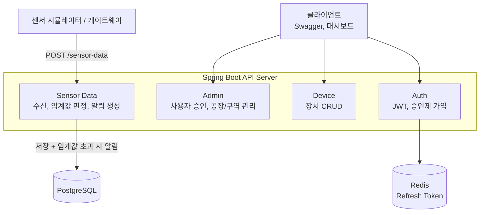
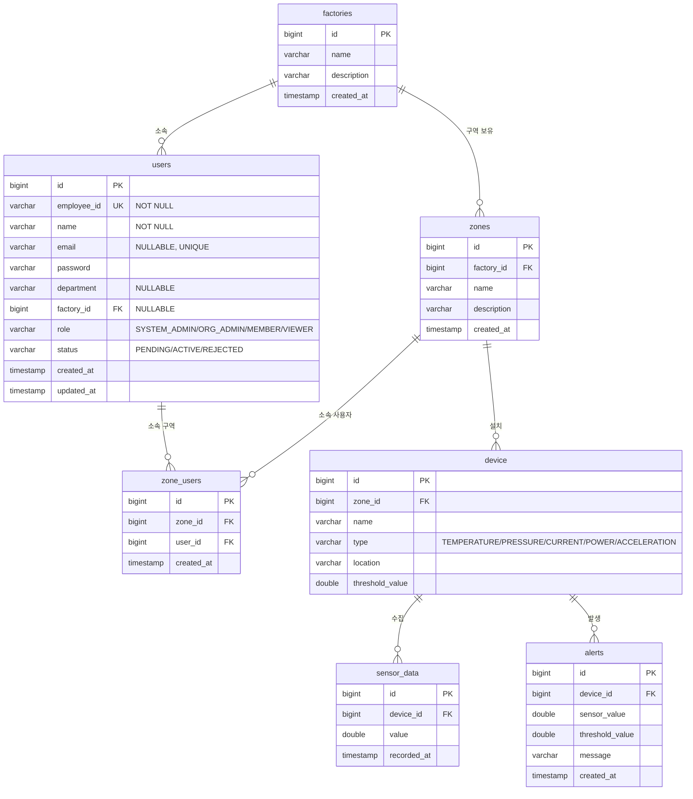

# IoT Sensor Platform

> 제조 설비 센서 데이터를 수집하고 이상 발생 시 근거와 함께 알림을 생성하는 센서 시계열 수집, 모니터링 백엔드

<br>


<br>

GitHub: https://github.com/YEONJI-P/iot-sensor-platform

<br>

---

## 목차

1. [프로젝트 소개](#1-프로젝트-소개)
2. [범위와 경계](#2-범위와-경계)
3. [기술 스택](#3-기술-스택)
4. [시스템 아키텍처](#4-시스템-아키텍처)
5. [ERD](#5-erd)
6. [API 명세](#6-api-명세)
7. [주요 기능](#7-주요-기능)
8. [확장 로드맵](#8-확장-로드맵)
9. [실행 방법](#9-실행-방법)
10. [설계 메모](#10-설계-메모)

---

## 1. 프로젝트 소개

제조 설비, 공장 환경에서 발생하는 센서 데이터를 수집하고, 임계값을 벗어난 이상 징후가 보이면 근거와 함께 알림을 생성하는 모니터링 백엔드입니다. 수집한 센서 시계열과 알림 이력은 영속 저장되어 사후 조회할 수 있습니다.

사번(employeeId) 기반의 승인제 회원 관리와 4단계 역할 기반 접근 제어(RBAC)를 통해, 공장, 구역 단위로 접근 범위를 제한합니다.

---

## 2. 범위와 경계

이 프로젝트는 게이트웨이가 HTTP/JSON으로 전달한 센서 데이터를 받아 저장하고 감시하는 백엔드입니다. 현장 프로토콜(Modbus, OPC-UA)의 수집과 변환은 범위 밖입니다.


실제 실시간 센서 대신, 저장된 센서 시계열을 시간 순으로 흘려보내 수신을 재현합니다.

---

## 3. 기술 스택

| 영역 | 기술 |
|---|---|
| Language | Java 17 |
| Framework | Spring Boot 3.x, Spring Security |
| Auth | JWT (JSON Web Token), Redis Refresh Token |
| ORM | Spring Data JPA (Hibernate) |
| Database | PostgreSQL |
| API Docs | Swagger (springdoc-openapi) |
| Test | JUnit5, Mockito, H2 |
| Container | Docker, Docker Compose |
| CI | GitHub Actions |

---

## 4. 시스템 아키텍처

센서 데이터 수신은 별도 메시지 버스 없이 동기 처리합니다. 수신 요청이 들어오면 한 트랜잭션 안에서 센서 데이터를 저장하고, 임계값 초과를 판정해 알림을 생성합니다.



---

## 5. ERD



---

## 6. API 명세

Swagger UI: `http://localhost:8080/swagger-ui/index.html`

### Auth

| Method | Endpoint | 설명 | 인증 |
|---|---|---|---|
| POST | `/auth/register` | 가입 신청 (status=PENDING) | 불필요 |
| POST | `/auth/login` | 로그인, ACTIVE 상태만 허용 | 불필요 |
| POST | `/auth/refresh` | Access Token 재발급 | 불필요 |

### Admin (ORG_ADMIN 이상)

| Method | Endpoint | 설명 | 인증 |
|---|---|---|---|
| GET | `/admin/users` | 전체 사용자 목록 | JWT |
| GET | `/admin/users/pending` | 승인 대기 목록 | JWT |
| PATCH | `/admin/users/{id}/approve` | 가입 승인, ACTIVE 전환 | JWT |
| PATCH | `/admin/users/{id}/reject` | 가입 반려, REJECTED 전환 | JWT |
| GET, POST | `/admin/factories` | 공장 조회, 등록 (SYSTEM_ADMIN) | JWT |
| PUT, DELETE | `/admin/factories/{id}` | 공장 수정, 삭제 (SYSTEM_ADMIN) | JWT |
| GET, POST | `/admin/zones` | 구역 조회, 등록 | JWT |
| PUT, DELETE | `/admin/zones/{id}` | 구역 수정, 삭제 | JWT |
| POST | `/admin/zones/{id}/users` | 구역에 사용자 추가 | JWT |
| DELETE | `/admin/zones/{id}/users/{userId}` | 구역에서 사용자 제거 | JWT |

### Device (인증 필요, 쓰기는 MEMBER 이상)

| Method | Endpoint | 설명 | 인증 |
|---|---|---|---|
| GET | `/devices` | 내 장치 목록 | JWT |
| POST | `/devices` | 장치 등록 | JWT |
| PUT | `/devices/{id}` | 장치 수정 | JWT |
| DELETE | `/devices/{id}` | 장치 삭제 | JWT |

### Sensor Data

| Method | Endpoint | 설명 | 인증 |
|---|---|---|---|
| POST | `/sensor-data` | 센서 데이터 수신 (게이트웨이, 장치 to 서버) | 불필요 |
| GET | `/sensor-data` | 전체 센서 데이터 조회 (페이지네이션, `?page=&size=&sort=`) | JWT |
| GET | `/sensor-data/{deviceId}` | 장치별 센서 데이터 조회 | JWT |

### Alert

| Method | Endpoint | 설명 | 인증 |
|---|---|---|---|
| GET | `/alerts` | 전체 알림 조회 (페이지네이션, `?page=&size=&sort=`) | JWT |
| GET | `/alerts/{deviceId}` | 장치별 알림 조회 | JWT |
| GET | `/alerts/recent?deviceId=&limit=` | 장치별 최근 알림 (대시보드) | JWT |
| GET | `/alerts/daily-count?deviceId=&days=` | 장치별 일자별 알림 수 (대시보드) | JWT |

---

## 7. 주요 기능

### 승인제 사용자 관리와 접근 제어

- 사번(employeeId) 기반 가입 신청, 가입 즉시 `PENDING` 상태로 저장
- `ORG_ADMIN` 이상의 관리자가 승인(`ACTIVE`) 또는 반려(`REJECTED`) 처리
- `PENDING`, `REJECTED` 상태에서 로그인 시 `DisabledException`으로 차단
- 4단계 역할 기반 접근 제어

  | 역할 | 범위 |
  |---|---|
  | `SYSTEM_ADMIN` | 전체 공장, 장치 |
  | `ORG_ADMIN` | 소속 공장의 구역, 사용자 관리 |
  | `MEMBER` | 소속 구역 읽기, 쓰기 (장치 관리) |
  | `VIEWER` | 소속 구역 읽기 전용 (장치 변경 불가) |

- 공장(Factory), 구역(Zone) 계층과 구역 소속 관계로 접근 범위를 계산하는 `AccessControlService`
- 초기 데이터는 `iot/seed.sql`(PostgreSQL) 일괄 투입

### 센서 데이터 수신과 알림

- `POST /sensor-data` 수신 시 한 트랜잭션에서 센서 데이터 저장, 임계값 초과 판정, 초과 시 알림 생성
- 별도 메시지 버스 없이 동기 처리 (설계 근거는 아래 설계 메모 참고)
- 수집한 센서 시계열과 알림 이력을 영속 저장하고 목록, 상세로 재조회

### 인증

- JWT 기반 stateless 인증, Redis에 Refresh Token 저장
- Refresh Token 회전, 불일치 시 저장 토큰을 삭제해 강제 로그아웃 처리

### 센서 시뮬레이터 (`iot/simulator.py`)

- 실제 센서처럼 서버 외부에서 `POST /sensor-data`를 직접 호출
- 장치 ID, 전송 간격(초), 횟수를 CLI 인자로 지정
- 임계값 기준 랜덤 센서값 생성 (정상값 80%, 초과값 20%)

### 정적 데모 대시보드

- 장치별 센서값 라인 차트, 알림 현황 시각화 (정적 데모)
- 실시간 갱신(SSE)은 로드맵 예정 항목

---

## 8. 확장 로드맵

### 완료

- JWT 인증, 인가, 사번 기반 로그인, 승인제 가입
- 4단계 역할 기반 접근 제어, 공장, 구역 계층 접근 제어
- 동기 센서 수신 파이프라인 (수신, 저장, 임계값 판정, 알림)
- Redis Refresh Token 저장, 회전
- 외부 시뮬레이터 스크립트

### 예정 (진행 방향)

- 이상 판정 로직 전략화 (`AnomalyDetector` 인터페이스로 분리)
- 알림 스키마 확장 (severity, 근거, 권고 필드 추가)
- 장치 freshness 감지 (기대 수신 주기 초과 시 알림)
- SSE 기반 실시간 대시보드
- LLM 기반 이상 근거, 원인 진단 (Python 서비스 연동)
- 실측 공개 센서 시계열(CNC, 터보팬) 리플레이로 시뮬레이터 데이터 교체

### 향후

- MQTT 수신 경로 도입 (엣지 게이트웨이와의 표준 연동)
- 대용량 시계열 저장소(TimescaleDB) 검토

---

## 9. 실행 방법

### 사전 요구사항

- Java 17
- Docker, Docker Compose (PostgreSQL, Redis 로컬 실행)

### 로컬 실행

```bash
# 1. 레포 클론
git clone https://github.com/YEONJI-P/iot-sensor-platform.git
cd iot-sensor-platform

# 2. 환경변수 파일 생성 (docker-compose 의 PostgreSQL 이 .env 를 요구)
cp .env.example .env

# 3. PostgreSQL, Redis 실행
docker-compose up -d

# 4. JWT 서명 키 설정, 기본값이 없어 미설정 시 부팅 실패 (셸 export 또는 IDE 실행 구성)
export JWT_SECRET=$(head -c 48 /dev/urandom | base64)

# 5. 애플리케이션 실행
./gradlew bootRun
```

> `.env` 는 docker-compose(Postgres) 전용이며 Spring 은 자동 로드하지 않습니다. 앱이 쓰는 `JWT_SECRET` 은 위처럼 셸이나 IDE에 직접 주입합니다.

### 테스트 실행

```bash
./gradlew test
```

> 테스트는 인메모리 H2(PostgreSQL 호환 모드)로 동작해 별도 인프라(Postgres, Redis) 없이 실행됩니다. 설정은 `src/test/resources/application.yml`.

### Swagger UI

```
http://localhost:8080/swagger-ui/index.html
```

### 초기 데이터 투입 (`iot/seed.sql`)

Spring Boot 기동 후 테이블이 생성된 상태에서 실행합니다.

```bash
psql -U postgres -d iot_sensor_db_v2 -f iot/seed.sql
```

> 재실행이 필요한 경우 `seed.sql` 하단의 `TRUNCATE` 주석을 해제 후 먼저 실행하세요.

투입되는 샘플 계정

| employeeId | 이름 | Role | password |
|---|---|---|---|
| `ADMIN001` | 시스템관리자 | SYSTEM_ADMIN | `admin1234!` |
| `MGR001` | 엔진동-관리자 | ORG_ADMIN | `mgr1234!` |
| `MGR002` | 가공동-관리자 | ORG_ADMIN | `mgr1234!` |
| `DEV001` | 설비담당자A | MEMBER | `dev1234!` |
| `ANL001` | 분석담당자A | MEMBER | `anl1234!` |
| `INP001` | 가공담당자B | MEMBER | `inp1234!` |
| `VWR001` | 열람자A | VIEWER | `vwr1234!` |
| `VWR002` | 열람자B | VIEWER | `vwr1234!` |

### 센서 시뮬레이터 실행 (`iot/simulator.py`)

실측 공개 데이터(C-MAPSS, CNC)를 시간 순으로 리플레이해 `POST /sensor-data`로 전송합니다. seed의 device(채널)와 1:1로 매핑됩니다.

```bash
# 1. 데이터 내려받기 (최초 1회)
bash iot/data/download.sh

# 2. 의존성 설치
pip install requests

# 3. 전체 7개 채널 리플레이 (1초 간격)
python iot/simulator.py --all

# 특정 채널만 / 간격·행수 조절
python iot/simulator.py --devices 1 6 --interval 0.5 --limit 100
```

> device id는 seed.sql의 device 삽입 순서와 일치합니다(1~4 = C-MAPSS 엔진, 5~7 = CNC 밀링).

### 환경변수

| 변수명 | 설명 | 기본값 |
|---|---|---|
| `DB_URL` | PostgreSQL JDBC URL | `jdbc:postgresql://localhost:5432/iot_sensor_db_v2` |
| `DB_USERNAME` | DB 사용자명 | `postgres` |
| `DB_PASSWORD` | DB 비밀번호 | `postgres` |
| `JWT_SECRET` | JWT 서명 키 (32자 이상) | 없음 (필수), 미설정 시 부팅 실패 |
| `REDIS_HOST` | Redis 호스트 | `localhost` |
| `REDIS_PORT` | Redis 포트 | `6379` |

---

## 10. 설계 메모

### 메시지 버스 제거

소비자가 하나뿐이고 타 서비스 연동도 없어 Kafka는 과설계였습니다. 수신 흐름을 동기 처리(저장, 임계값 판정, 알림 생성)로 단순화하고 제거했습니다. 다중 소비자가 실제로 필요해지면 버스 도입을 재검토합니다.

### 접근 제어 계층

공장(Factory), 구역(Zone), 구역 소속(ZoneUser) 3계층으로 접근 범위를 계산합니다. `SYSTEM_ADMIN`은 전체, `ORG_ADMIN`은 소속 공장, `MEMBER`와 `VIEWER`는 소속 구역으로 범위가 좁혀지며, `VIEWER`는 읽기 전용으로 장치 변경이 차단됩니다.

### 검토 중

- SensorType 외부화 검토: 현재 SensorType(`TEMPERATURE`, `VIBRATION`, `ILLUMINANCE`, `PRESSURE`)이 Enum으로 하드코딩되어 있어 타입 추가 시 빌드가 필요합니다. 임계값 초과 감지 로직이 타입에 무관하게 동일하므로 외부 설정으로 관리할 여지가 있습니다. 반면 Role, UserStatus는 값마다 인가 로직과 상태 전이가 코드에 묶여 있어 Enum이 적합합니다.
